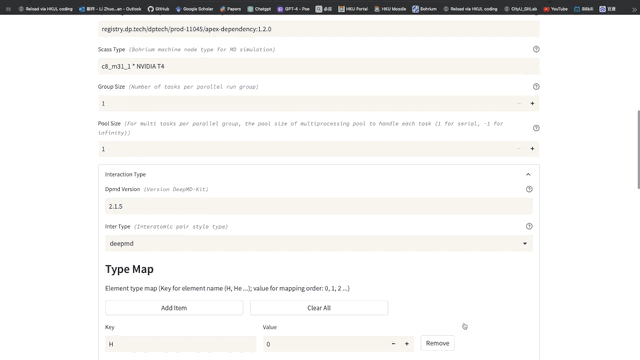
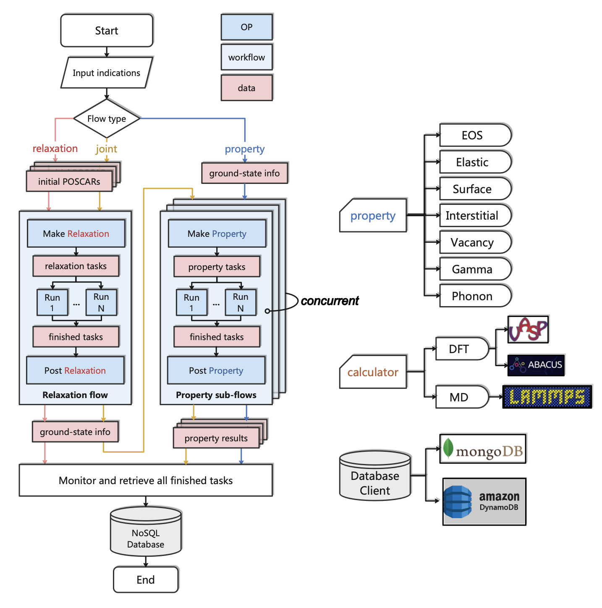
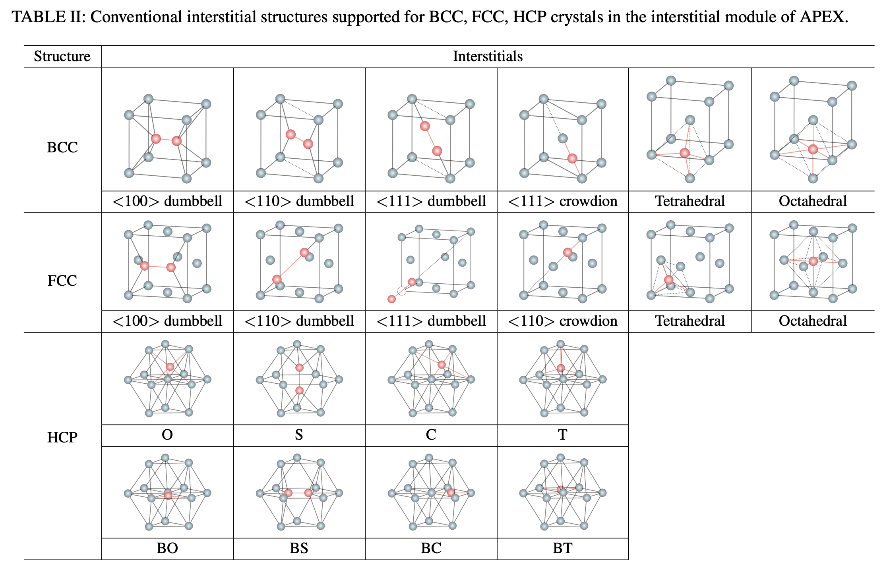
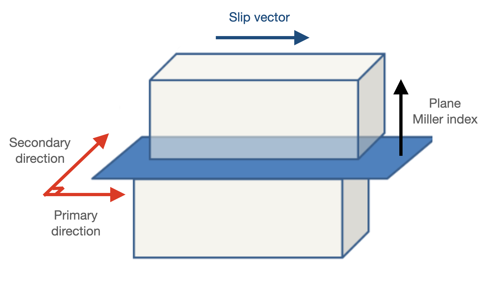
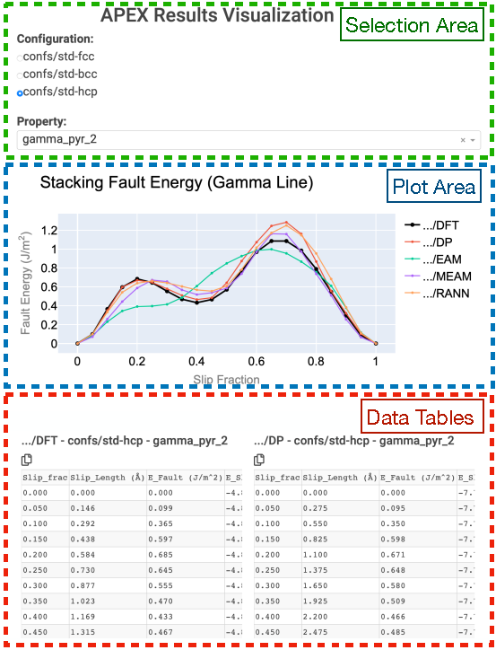

<div style="text-align: center;">
    
</div>

# APEX: Alloy Property EXplorer
[](https://github.com/deepmodeling/APEX)

[APEX](https://github.com/deepmodeling/APEX): Alloy Property EXplorer is a component of the [AI Square](https://aissquare.com/) project that involves the restructuring of the [DP-GEN](https://github.com/deepmodeling/dpgen) `auto_test` module to develop a versatile and extensible Python package for general alloy property calculations. This package enables users to conveniently establish a wide range of cloud-native property-test workflows by utilizing various computational approaches, including LAMMPS, VASP, ABACUS, and others.



## v1.2 Main Features Update
* Add a `retrieve` sub-command to allow results to be retrieved independently and manually for multiple properties (Remove `Distributor` and `Collector` OP)
* Support common **dflow operations** with terminal commands
* Incorporate results `archive` function to both local paths and NoSQL database ([MongoDB](https://www.mongodb.com/) and [DynamoDB](https://aws.amazon.com/cn/dynamodb/))
* Add a `report` sub-command for quick results visualization and cross-comparison via a front-end APP based on [Dash](https://dash.plotly.com)
* Support [SeeK-path](https://seekpath.readthedocs.io/en/latest/index.html) for automatic band path search in `phonon` calculations
* Support eight conventional HCP interstitial configurations for `interstitial` calculations
* Add four additional **ML** pair styles (`snap`, `gap`, `rann` and `mace`) and an extra `meam-spline` in LAMMPS interation type support
* Modify the single-step run command from `test` to `do` for improved clarity and consistencey

## APEX Bohrium App
[](https://bohrium.dp.tech/apps/apex)

APEX also provides a web-based [Bohrium App](https://bohrium.dp.tech/apps/apex) for rapid and easy alloy property calculations without intensive JSON configuration (Note: one will need a Bohrium account to access this service).

## How to cite APEX
[](https://doi.org/10.1038/s41524-025-01580-y)

If you use APEX in your research, please cite the following paper for general purpose: 

> Li, Z., Wen, T., Zhang, Y. et al. APEX: an automated cloud-native material property explorer. npj Comput Mater 11, 88 (2025). https://doi.org/10.1038/s41524-025-01580-y

## Table of Contents

- [APEX: Alloy Property EXplorer](#apex-alloy-property-explorer)
  - [v1.2 Main Features Update](#v12-main-features-update)
  - [APEX Bohrium App](#apex-bohrium-app)
  - [How to cite APEX](#how-to-cite-apex)
  - [Table of Contents](#table-of-contents)
  - [1. Overview](#1-overview)
  - [2. Quick Start](#2-quick-start)
    - [2.1. Install APEX](#21-install-apex)
    - [2.2. Install Local Argo (Optional)](#22-install-local-argo-optional)
    - [2.3. Submission Examples](#23-submission-examples)
      - [2.3.1. Submit to Local Argo Service](#231-submit-to-local-argo-service)
      - [2.3.2. Submit Without Argo Service](#232-submit-without-argo-service)
      - [2.3.3. Submit to the Bohrium](#233-submit-to-the-bohrium)
  - [3. Documents \& User Guide](#3-documents--user-guide)
    - [3.1. Before Submission](#31-before-submission)
      - [3.1.1. Global Setting](#311-global-setting)
      - [3.1.2. Calculation Parameters](#312-calculation-parameters)
        - [3.1.2.1. EOS](#3121-eos)
        - [3.1.2.2. Elastic](#3122-elastic)
        - [3.1.2.3. Surface](#3123-surface)
        - [3.1.2.4. Vacancy](#3124-vacancy)
        - [3.1.2.5. Interstitial](#3125-interstitial)
        - [3.1.2.6. Gamma Line](#3126-gamma-line)
        - [3.1.2.7. Phonon Spectra](#3127-phonon-spectra)
    - [3.2. Submission](#32-submission)
      - [3.2.1. Workflow Submission](#321-workflow-submission)
      - [3.2.2. Workflow Inquiry \& Operations](#322-workflow-inquiry--operations)
      - [3.2.3. Run Individual Step](#323-run-individual-step)
    - [3.3. After Submission](#33-after-submission)
      - [3.3.1. Retrieve Results Manually](#331-retrieve-results-manually)
      - [3.3.2. Archive Test Results](#332-archive-test-results)
      - [3.3.3. Results Visualization Report](#333-results-visualization-report)

## 1. Overview

APEX adopts the functionality of the second-generation `auto_test` for alloy properties calculations and is developed utilizing the [dflow](https://github.com/deepmodeling/dflow) framework. By integrating the benefits of cloud-native workflows, APEX streamlines the intricate procedure of automatically testing various configurations and properties. Owing to its cloud-native characteristic, APEX provides users with a more intuitive and user-friendly interaction, enhancing the overall user experience by eliminating concerns related to process control, task scheduling, observability, and disaster tolerance.

The comprehensive architecture of APEX is demonstrated below:

<div style="text-align: center;">
    
    <p style='font-size:1.0rem; font-weight:none'>Figure 1. Schematic diagram of APEX</p>
</div>

APEX consists of three types of pre-defined **workflow** that users can submit: `relaxation`, `property`, and `joint`. The `relaxation` and `property` sub-workflow comprise three sequential **steps**: `Make`, `Run`, and `Post`, while the `joint` workflow essentially combines the `relaxation` and `property` workflows into a comprehensive workflow.

The `relaxation` process begins with the initial `POSCAR` supplied by the user, which is used to generate critical data such as the final relaxed structure and its corresponding energy, forces, and virial tensor. This equilibrium state information is essential for input into the `property` workflow, enabling further calculations of alloy properties. Upon completion, the final results are automatically retrieved and downloaded to the original working directory.

In both the `relaxation` and `property` workflows, the `Make` step prepares the corresponding computational tasks. These tasks are then transferred to the `Run` step that is responsible for task dispatch, calculation monitoring, and retrieval of completed tasks (implemented through the [DPDispatcher](https://github.com/deepmodeling/dpdispatcher/tree/master) plugin). Upon completion of all tasks, the `Post` step is initiated to collect data and obtain the desired property results.

APEX currently offers calculation methods for the following alloy properties:

* Equation of State (EOS)
* Elastic constants
* Surface energy
* Interstitial formation energy
* Vacancy formation energy
* Generalized stacking fault energy (Gamma line)
* Phonon spectra

Moreover, APEX supports three types of calculators: **LAMMPS** for molecular dynamics simulations, and **VASP** and **ABACUS** for first-principles calculations.

## 2. Quick Start
### 2.1. Install APEX
The latest version of APEX can be easily installed via `pypi` with following command:
```shell
pip install apex-flow
```
The second approach is to intall from the source code. Firstly clone the code from repository:
```shell
git clone https://github.com/deepmodeling/APEX.git
```
then install APEX by:
```shell
cd APEX
pip install .
```

### 2.2. Install Local Argo (Optional)
APEX workflow can be boosted and better orgnized by the [Argo](https://argoproj.github.io/workflows/) workflow engine, which provides intuitive process monitoring UI and multiple user-friendly workflow management functions. 

To enable this feature on your local computer, you can setup the dflow service by executing [installation scripts](./docs/scripts/) prepared based on Unix-like system. For instance, to install on a Linux system without root access:
```shell
bash install-linux-cn.sh
```
This process will automatically configure the required local tools, including Docker, Minikube, and Argo service, with the default port set to `127.0.0.1:2746`. To setup the service on Windows, please refer to the [dflow setup manual](https://github.com/deepmodeling/dflow/tree/master/tutorials) for more details.


### 2.3. Submission Examples
We present several case studies as introductory illustrations of APEX, tailored to distinct user scenarios. For our demonstration, we will utilize a [LAMMPS_example](./examples/lammps_demo) to compute the Equation of State (EOS) and elastic constants of molybdenum in both Body-Centered Cubic (BCC) and Face-Centered Cubic (FCC) phases. To begin, we will examine the files prepared within the working directory for this specific case.

```
lammps_demo
├── confs
│   ├── std-bcc
│   │   └── POSCAR
│   └── std-fcc
│       └── POSCAR
├── frozen_model.pb
├── global_bohrium.json
├── global_hpc.json
├── param_joint.json
├── param_props.json
└── param_relax.json
```
There are three types of parameter files and two types of global config files, as well as a Deep Potential file of molybdenum `frozen_model.pb`. Under the directory of `confs`, structure file `POSCAR` of both phases have been prepared respectively.

#### 2.3.1. Submit to Local Argo Service
Before this subsection, make sure you have setup a local Argo service environment. If not, please follow the instruction in [2.2. Install Local Argo (Optional)](#22-install-local-argo-optional) to do so.

To submit workflow to local Argo service, with the default port set to `127.0.0.1:2746`. Consequently, one can modify the `global_hpc.json` file to submit a workflow. Here is an example to submit job to local LAMMPS env:
```json
{
    "apex_image_name":"zhuoyli/apex_amd64",
    "run_image_name": "zhuoyli/apex_amd64",
    "run_command":"lmp -in in.lammps",
    "batch_type": "Shell",
    "context_type": "Local",
    "local_root" : "./",
    "remote_root": "/some/path/not/under/pwd/"
}
```
Another example to submit job to a remote HPC. In this example, we attempt to distribute tasks to a remote node managed by [Slurm](https://slurm.schedmd.com). Users can replace the relevant parameters within the `machine` dictionary or specify `resources` and `tasks` according to [DPDispatcher](https://docs.deepmodeling.com/projects/dpdispatcher/en/latest/index.html) rules. Here is an example `global_hpc.json` file:
```json
{
    "apex_image_name":"zhuoyli/apex_amd64",
    "run_image_name": "zhuoyli/apex_amd64",
    "run_command":"lmp -in in.lammps",
    "context_type": "SSHContext",
    "mechine":{
      "batch_type": "Slurm",
      "context_type": "SSHContext",
      "local_root" : "./",
      "remote_root": "/your/remote/tasks/path",
      "clean_asynchronously": true,
      "remote_profile": {
          "hostname": "123.12.12.12",
          "username": "USERNAME",
          "password": "PASSWD",
          "port": 22,
          "timeout": 10
      }
    },
    "resources":{
        "number_node": 1,
        "cpu_per_node": 4,
        "gpu_per_node": 0,
        "queue_name": "apex_test",
        "group_size": 1,
        "module_list": ["deepmd-kit/2.1.0/cpu_binary_release"],
        "custom_flags": [
            "#SBATCH --partition=xlong",
            "#SBATCH --ntasks=4",
            "#SBATCH --mem=10G",
            "#SBATCH --nodes=1",
            "#SBATCH --time=1-00:00:00"
            ]
       }
}
```

Then, one can submit a relaxation workflow via:
```shell
apex submit param_relax.json -c global_hpc.json
```

Upon submission of the workflow, progress can be monitored at local https://127.0.0.1:2746. If the argo is setup on system without monitor UI, you may try to port forward the `127.0.0.1:2746` to another PC by running following command on that PC:
```shell
ssh -nNT -L 127.0.0.1:2746:127.0.0.1:2746 USERNAME@123.12.12.12
```
Then, you can monitor the UI through https://127.0.0.1:2746

#### 2.3.2. Submit Without Argo Service
If your local computer experiences difficulties connecting to the internet or installing cloud-native infrastructures like Docker and Argo, APEX offers a **workflow local debug mode** that allows the flow to operate in a basic `Python3` environment, independent of the Docker container. Users will **not** be able to monitor the workflow through the workflow UI. However, the workflows are still running automatically.

To enable this function, users can add an additional optional argument `-d` to the origin submission command, as demonstrated below:

```shell
apex submit -d param_relax.json -c global_hpc.json
```

In this approach, uses are not required to specify an image for executing APEX. Rather, APEX should be pre-installed in the default `Python3` environment to ensure proper functioning.

#### 2.3.3. Submit to the Bohrium
The most efficient method for submitting an APEX workflow is through the pre-built execution environment of Argo on the [Bohrium cloud platform](https://bohrium.dp.tech). This is especially convenient and robust for massive task-intensive workflows running concurrently. It is necessary to create a **Bohrium account** before running. Below is an example of a global.json file for this approach.

```json
{
    "dflow_host": "https://workflows.deepmodeling.com",
    "k8s_api_server": "https://workflows.deepmodeling.com",
    "batch_type": "Bohrium",
    "context_type": "Bohrium",
    "email": "YOUR_EMAIL",
    "password": "YOUR_PASSWD",
    "program_id": 1234,
    "apex_image_name":"registry.dp.tech/dptech/prod-11045/apex-dependency:1.2.0",
    "lammps_image_name": "registry.dp.tech/dptech/prod-11045/deepmdkit-phonolammps:2.1.1",
    "lammps_run_command":"lmp -in in.lammps",
    "scass_type":"c8_m31_1 * NVIDIA T4"
}
```
Then, one can submit a relaxation workflow via:
```shell
apex submit param_relax.json -c global_bohrium.json
```
Remember to replace `email`, `password` and `program_id` of your own before submission. As for image, you can either build your own or use public images from Bohrium or pulling from the Docker Hub. Once the workflow is submitted, one can monitor it at https://workflows.deepmodeling.com.

You may also checkout our online [hand-on Bohrium notebook tutorial](https://bohrium.dp.tech/notebooks/15413) for submisson to Bohrium.

## 3. Documents & User Guide

### 3.1. Before Submission
In APEX, there are **three essential components** required before submitting a workflow:
* **A global JSON file** containing parameters for configuring `dflow` and other global settings (default: "./global.json")
* **A calculation JSON file** containing parameters associated with calculations (relaxation and property test)
* **A work directory** consists of necessary files specified in the above JSON files, along with initial structures (default: "./")


#### 3.1.1. Global Setting
The instructions regarding global configuration, [dflow](https://github.com/deepmodeling/dflow), and [DPDispatcher](https://github.com/deepmodeling/dpdispatcher/tree/master) specific settings must be stored in a JSON format file. The table below describes some crucial keywords, classified into three categories:

* **Basic config**
  | Key words | Data structure | Default | Description |
  | :------------ | ----- | ----- | ------------------- |
  | apex_image_name | String | zhuoy/apex_amd64 | Image for step other than `run`. One can build this Docker image via prepared [Dockerfile](./docs/Dockerfile) |
  | run_image_name | String | None | Image of calculator for `run` step. Use `{calculator}_image_name` to indicate corresponding image for higher priority |
  | run_command | String | None | Shell command for `run` step. Use `{calculator}_run_command` to indicate corresponding command for higher priority |
  | group_size | Int | 1 | Number of tasks per parallel run group |
  | pool_size | Int | 1 | For multi tasks per parallel group, the pool size of multiprocessing pool to handle each task (1 for serial, -1 for infinity) |
  | upload_python_package | Optional[List] | None | Additional python packages required in the container |
  | debug_pool_workers | Int | 1 | Pool size of parallel tasks running in the debug mode | 
  | flow_name | String | None | Specify name of workflow to be submitted (default: work path name) |
  | submit_only | Bool | False | Submit workflow only without automatic result retrieving |

* **Dflow config**
  | Key words | Data structure | Default | Description |
  | :------------ | ----- | ----- | ------------------- |
  | dflow_host | String | https://127.0.0.1:2746 | Url of dflow server |
  | k8s_api_server | String | https://127.0.0.1:2746 | Url of kubernetes API server |
  | dflow_config | Optional[Dict] | None | Specify more detailed dflow config in a nested dictionary with higher priority (See [dflow document](https://deepmodeling.com/dflow/dflow.html) for more detail) |
  | dflow_s3_config | Optional[Dict] | None | Specify dflow s3 repository config in a nested dictionary with higher priority (See [dflow document](https://deepmodeling.com/dflow/dflow.html) for more detail) |

* **Dispatcher config** (One may refer to [DPDispatcher’s documentation](https://docs.deepmodeling.com/projects/dpdispatcher/en/latest/index.html) for details of the following parameters)
  | Key words | Data structure | Default | Description |
  | :------------ | ----- | ----- | ------------------- |
  | context_type | String | None | Context type to connect to the remote server |
  | batch_type | String | None | System to dispatch tasks |
  | local_root | String | "./" | Local root path |
  | remote_root | String | None | Remote root path |
  | remote_host | String | None | Remote root path |
  | remote_username | String | None | Remote user name |
  | remote_password | String | None | Remote user password |
  | port | Int | 22 | Remote port |
  | machine | Optional[Dict] | None | Complete **machine setting** dictionary defined in the [DPDispatcher](https://docs.deepmodeling.com/projects/dpdispatcher/en/latest/index.html) with higher priority |
  | resources | Optional[Dict] | None | Complete **resources setting** dictionary defined in the [DPDispatcher](https://docs.deepmodeling.com/projects/dpdispatcher/en/latest/index.html) with higher priority |
  | task | Optional[Dict] | None | Complete **task setting** dictionary defined in the [DPDispatcher](https://docs.deepmodeling.com/projects/dpdispatcher/en/latest/index.html) with higher priority |

* **Bohrium** (additonal dispatcher config to be specified when you want to quickly adopt the pre-built dflow service or scientific computing resources on the [Bohrium platform](https://bohrium.dp.tech) )
  | Key words | Data structure | Default | Description |
  | :------------ | ----- | ----- | ------------------- |
  | email | String | None | Email of your Bohrium account |
  | phone | String | None | Phone number of your Bohrium account |
  | password | String | None | Password of your Bohrium account |
  | program_id | Int | None | Program ID of your Bohrium account |
  | scass_type | String | None | Node type provided by Bohrium |

Please refer to the [Quick Start](#4-quick-start) section for various instances of global JSON examples in different situations.

#### 3.1.2. Calculation Parameters
The method for indicating parameters in alloy property calculations is akin to the previous `dpgen.autotest` approach. There are **three** categories of JSON files that determine the parameters to be passed to APEX, based on their contents.

Categories calculation parameter files:
| Type | File format | Dictionary contained | Usage |
| :------------ | ---- | ----- | ------------------- |
| Relaxation | json | `structures`; `interaction`; `Relaxation` | For `relaxation` worflow |
| Property | json |  `structures`; `interaction`; `Properties`  | For `property` worflow |
| Joint | json |  `structures`; `interaction`; `Relaxation`; `Properties` | For `relaxation`, `property` and `joint` worflows |

It should be noted that files such as POSCAR, located within the `structure` directory, or any other files specified within the JSON file should be defined as relative path to the **working directory** and prepared in advanced.

Below are three examples (for detailed explanations of each parameter, please refer to the [Hands-on_auto-test](./docs/Hands_on_auto-test.pdf) documentation for further information):

* **Relaxation parameter file**
  ```json
  {
    "structures":            ["confs/std-*"],
    "interaction": {
            "type":           "deepmd",
            "model":          "frozen_model.pb",
            "type_map":       {"Mo": 0}
	  },
    "relaxation": {
            "cal_setting":   {"etol":       0,
                              "ftol":     1e-10,
                              "maxiter":   5000,
                              "maximal":  500000}
	  }
  }
  ```
* **Property parameter file**
  ```json
  {
    "structures":    ["confs/std-*"],
    "interaction": {
        "type":          "deepmd",
        "model":         "frozen_model.pb",
        "type_map":      {"Mo": 0}
    },
    "properties": [
        {
          "type":         "eos",
          "skip":         false,
          "vol_start":    0.6,
          "vol_end":      1.4,
          "vol_step":     0.1,
          "cal_setting":  {"etol": 0,
                          "ftol": 1e-10}
        },
        {
          "type":         "elastic",
          "skip":         false,
          "norm_deform":  1e-2,
          "shear_deform": 1e-2,
          "cal_setting":  {"etol": 0,
                          "ftol": 1e-10}
        }
        ]
  }
  ```
* **Joint parameter file**
  ```json
  {
    "structures":            ["confs/std-*"],
    "interaction": {
          "type":           "deepmd",
          "model":          "frozen_model.pb",
          "type_map":       {"Mo": 0}
      },
    "relaxation": {
            "cal_setting":   {"etol":       0,
                            "ftol":     1e-10,
                            "maxiter":   5000,
                            "maximal":  500000}
      },
    "properties": [
      {
        "type":         "eos",
        "skip":         false,
        "vol_start":    0.6,
        "vol_end":      1.4,
        "vol_step":     0.1,
        "cal_setting":  {"etol": 0,
                        "ftol": 1e-10}
      },
      {
        "type":         "elastic",
        "skip":         false,
        "norm_deform":  1e-2,
        "shear_deform": 1e-2,
        "cal_setting":  {"etol": 0,
                        "ftol": 1e-10}
      }
      ]
  }
  ```
##### 3.1.2.1. EOS
  | Key words | Data structure | Example | Description                                               |
  | :------------ | ----- |-----------------------------------------------------------| ------------------- |
  | vol_start | Float | 0.9 | The starting volume related to the equilibrium structure  |
  | vol_end | Float | 1.1 | The maximum volume related to the equilibrium structure   |
  | vol_step | Float | 0.01 | The volume increment related to the equilibrium structure |
  | vol_abs | Bool | False | Whether to treat vol_start and vol_end as absolute volume, default = False |

##### 3.1.2.2. Elastic
  | Key words    | Data structure | Example | Description                                                                                                                       |
  |:-------------|----------------|---------|-----------------------------------------------------------------------------------------------------------------------------------|
  | norm_deform  | Float          | 0.01    | The deformation in xx, yy, zz, defaul = 1e-2                                                                                      |
  | shear_deform | Float          | 0.01    | The deformation in other directions, default = 1e-2                                                                               |
  | conventional | Bool           | False   | Whether adopt conventional cell for deformation                                                                                   |
  | ieee         | Bool           | False   | Whether rotate relaxed structure into IEEE-standard format before deformation ([ref](https://ieeexplore.ieee.org/document/26560)) |
  | modulus_type | String         | "voigt"   | Bulk and shear modulus average type (default: "voigt"). Choose from "voigt", "reuss" and "vrh"                                    |

##### 3.1.2.3. Surface
  | Key words | Data structure | Example | Description |
  | :------------ | ----- |----------------------------------------------------------------------------------| ------------------- |
  | min_slab_size | Int | 10 | Minimum size of slab thickness |
  | min_vacuum_size | Int | 11 | Minimum size of vacuum width |
  | pert_xz | Float | 0.01 | Perturbation through xz direction used to compute surface energy, default = 0.01 |
  | max_miller | Int | 2 | The maximum miller index number of surface, default = 2 |

##### 3.1.2.4. Vacancy
  | Key words | Data structure | Example | Description |
  | :------------ | ----- | ----- | ------------------- |
  | supercell | List[Int] | [3, 3, 3] | The supercell to be constructed, default = [1,1,1] |

##### 3.1.2.5. Interstitial
  | Key words | Data structure | Example | Description |
  | :------------ | ----- | ----- | ------------------- |
  | insert_ele | List[String] | ["Al"] | The element to be inserted |
  | supercell | List[Int] | [3, 3, 3] | The supercell to be constructed, default = [1,1,1] |
  | conf_filters | Dict | "min_dist": 1.5 | Filter out the undesirable configuration |
  <div>
      
      <p style='font-size:1.0rem; font-weight:none'> </p>
  </div>

##### 3.1.2.6. Gamma Line
  <div style="text-align: center;">
      
      <p style='font-size:1.0rem; font-weight:none'>Figure 2. Schematic diagram of Gamma line calculation</p>
  </div>

The Gamma line (generalized stacking fault energy) function of APEX calculates energy of a series slab structures of specific crystal plane, which displaced in the middle along a slip vector as illustrated in **Figure 2**. In APEX, the slab structrures are defined by a plane miller index and two orthogonal directions (primary and secondary) on the plane. The **slip vector is always along the primary directions** with slip length defined by users or default settings. Thus, by indicating `plane_miller` and the `slip_direction` (i.e., primary direction), a slip system can be defined.

For most common slip systems in FCC, BCC and HCP crystal structures, slip direction, secondary direction and default fractional slip lengths are already documented and listed below (users are **strongly advised** to follow those pre-defined slip system, or may need to double-check the generated slab structure, as unexpected results may occur especially for system like HCP):
* FCC
  | Plane miller index | Slip direction | Secondary direction | Default slip length |
  | :-------- | ----- | ----- | ---- |
  | $(001)$ | $[100]$ | $[010]$ | $a$ |
  | $(110)$ | $[\bar{1}10]$ | $[001]$ | $\sqrt{2}a$ |
  | $(111)$ | $[11\bar{2}]$ | $[\bar{1}10]$ | $\sqrt{6}a$ |
  | $(111)$ | $[\bar{1}\bar{1}2]$ | $[1\bar{1}0]$ | $\sqrt{6}a$ |
  | $(111)$ | $[\bar{1}10]$ | $[\bar{1}\bar{1}2]$ | $\sqrt{2}a$ |
  | $(111)$ | $[1\bar{1}0]$ | $[11\bar{2}]$ | $\sqrt{2}a$ |

* BCC
  | Plane miller index | Slip direction | Secondary direction | Default slip length |
  | :-------- | ----- | ----- | ---- |
  | $(001)$ | $[100]$ | $[010]$ | $a$ |
  | $(111)$ | $[\bar{1}10]$ | $[\bar{1}\bar{1}2]$ | $\frac{\sqrt{2}}{2}a$ |
  | $(110)$ | $[\bar{1}11]$ | $[00\bar{1}]$ | $\frac{\sqrt{3}}{2}a$ |
  | $(110)$ | $[1\bar{1}\bar{1}]$ | $[001]$ | $\frac{\sqrt{3}}{2}a$ |
  | $(112)$ | $[11\bar{1}]$ | $[\bar{1}10]$ | $\frac{\sqrt{3}}{2}a$ |
  | $(112)$ | $[\bar{1}\bar{1}1]$ | $[1\bar{1}0]$ | $\frac{\sqrt{3}}{2}a$ |
  | $(123)$ | $[11\bar{1}]$ | $[\bar{2}10]$ | $\frac{\sqrt{3}}{2}a$ |
  | $(123)$ | $[\bar{1}\bar{1}1]$ | $[2\bar{1}0]$ | $\frac{\sqrt{3}}{2}a$ |

* HCP (Bravais lattice)
  | Plane miller index | Slip direction | Secondary direction | Default slip length |
  | :-------- | ----- | ----- | ---- |
  | $(0001)$ | $[2\bar{1}\bar{1}0]$ | $[01\bar{1}0]$ | $a$ |
  | $(0001)$ | $[1\bar{1}00]$ | $[01\bar{1}0]$ | $\sqrt{3}a$ |
  | $(0001)$ | $[10\bar{1}0]$ | $[01\bar{1}0]$ | $\sqrt{3}a$ |
  | $(01\bar{1}0)$ | $[\bar{2}110]$ | $[000\bar{1}]$ | $a$ |
  | $(01\bar{1}0)$ | $[0001]$ | $[\bar{2}110]$ | $c$ |
  | $(01\bar{1}0)$ | $[\bar{2}113]$ | $[000\bar{1}]$ | $\sqrt{a^2+c^2}$ |
  | $(\bar{1}2\bar{1}0)$ | $[\bar{1}010]$ | $[000\bar{1}]$ | $\sqrt{3}a$ |
  | $(\bar{1}2\bar{1}0)$ | $[0001]$ | $[\bar{1}010]$ | $c$ |
  | $(01\bar{1}1)$ | $[\bar{2}110]$ | $[\bar{1}2\bar{1}\bar{3}]$ | $a$ |
  | $(01\bar{1}1)$ | $[\bar{1}2\bar{1}\bar{3}]$ | $[2\bar{1}\bar{1}0]$ | $\sqrt{a^2+c^2}$ |
  | $(01\bar{1}1)$ | $[0\bar{1}12]$ | $[\bar{1}2\bar{1}\bar{3}]$ | $\sqrt{3a^2+4c^2}$ |
  | $(\bar{1}2\bar{1}2)$ | $[10\bar{1}0]$ | $[1\bar{2}13]$ | $\sqrt{3}a$ |
  | $(\bar{1}2\bar{1}2)$ | $[1\bar{2}13]$ | $[\bar{1}010]$ | $\sqrt{a^2+c^2}$ |

The parameters related to Gamma line calculation are listed below:
  | Key words | Data structure | Default | Description |
  | :------------ | ----- | ----- | ------------------- |
  | plane_miller | Sequence[Int] | None | Miller index of the target slab |
  | slip_direction | Sequence[Int] | None | Miller index of slip (primary) direction of the slab |
  | slip_length | Int\|Float; Sequence[Int\|Float, Int\|Float, Int\|Float] | Refer to specific slip system as the table shows above, or 1 if not indicated | Slip length along the primary direction with default unit set by users or default setting. As for format of `[x, y, z]`, the length equals to $\sqrt{(xa)^2+(yb)^2+(zc)^2}$ |
  | plane_shift | Int\|Float | 0 | Shift of displacement plane with unit of lattice parameter **$c$** (positive for upwards). This allows creating slip plane within narrowly-spaced planes (see [ref](https://doi.org/10.1016/j.actamat.2016.10.042)). |
  | n_steps | Int | 10 | Number of steps to displace slab along the slip vector  |
  | vacuum_size | Int\|Float | 0 | Thickness of vacuum layer added around the slab with unit of Angstrom |
  | supercell_size | Sequence[Int, Int, Int] | [1, 1, 5] | Size of generated supercell based on slab structure |
  | add fix | Sequence[Str, Str, Str] | ["true","true","false"] | Whether to add fix position constraint along x, y and z direction during calculation |

  Here is an example:
  ```json
  {
	  "type":            "gamma",
	  "skip":            true,
      "plane_miller":    [0,0,1],
      "slip_direction":  [1,0,0],
	  "hcp": {
        	"plane_miller":    [0,1,-1,1],
        	"slip_direction":  [-2,1,1,0],
          "slip_length":     [1,0,1],
          "plane_shift": 0.25
		},
      "supercell_size":   [1,1,6],
      "vacuum_size": 10,
	  "add_fix": ["true","true","false"],
      "n_steps":         10
	}
  ```
  It should be noted that for various crystal structures, **users can further define slip parameters within the respective nested dictionaries, which will be prioritized for adoption**. In the example above, the slip system configuration within the "hcp" dictionary will be utilized.

##### 3.1.2.7. Phonon Spectra
This function incorporates part of [dflow-phonon](https://github.com/Chengqian-Zhang/dflow-phonon) codes into APEX to make it more complete. This workflow is realized via [Phonopy](https://github.com/phonopy/phonopy), and [phonoLAMMPS](https://github.com/abelcarreras/phonolammps) for LAMMPS calculation. In APEX, this part includes the [SeeK-path](https://seekpath.readthedocs.io/en/latest/index.html) for automatically high-symmetry points searching for phonon calculation.

**IMPORTANT!!**: it should be noted that the **phonoLAMMPS** package must be pre-installed in the user's `run_image` to ensure accurate `LAMMPS` calculations for the phonon spectra.

Parameters related to `Phonon` calculations are listed below:
  | Key words | Data structure | Default | Description |
  | :------------ | ----- | ----- | ------------------- |
  | primitive | Bool | False | Whether to find primitive lattice structure for phonon calculation |
  | approach | String | "linear" | Specify phonon calculation method when using `VASP`; Two options: 1. "linear" for the *Linear Response Method*, and 2. "displacement" for the *Finite Displacement Method* |
  | supercell_size | Sequence[Int] | [2, 2, 2] | Size of supercell created for calculation |
  | MESH | Sequence[Int] | None | Specify the dimensions of the grid in reciprocal space for which the phonon frequencies and eigenvectors are to be calculated. For example: [8, 8, 8]; Refer to [Phonopy MESH](http://phonopy.github.io/phonopy/setting-tags.html#mesh-sampling-tags) |
  | PRIMITIVE_AXES | String | None | To define the basis vectors of a primitive cell in terms of the basis vectors of a conventional cell for input cell transformation. For example: "0.0 0.5 0.5 0.5 0.0 0.5 0.5 0.5 0.0"; Refer to [Phonopy PRIMITIVE_AXES](http://phonopy.github.io/phonopy/setting-tags.html#primitive-axes-or-primitive-axis) |
  | BAND | String | None | (Optional) Indicate band path in reciprocal space as format of [Phonopy BAND](http://phonopy.github.io/phonopy/setting-tags.html#band-and-band-points); For example: "0 0 0 1/2 0 1/2, 1/2 1/2 1 0 0 0 1/2 1/2 1/2". If not specified, the [seekpath](https://seekpath.readthedocs.io/en/latest/#) package will be adopted to automatically determine band path according to relaxed structure |
  | BAND_LABELS | String | None | (Optional) Indication of band path labels for report plot |
  | BAND_POINTS | Int | 51 | Number of sampling points including the path ends |
  | BAND_CONNECTION | Bool | True | With this option, band connections are estimated from eigenvectors and band structure is drawn considering band crossings. In sensitive cases, to obtain better band connections, it requires to increase number of points calculated in band segments by the `BAND_POINTS` tag |
  | seekpath_from_original | Bool | False | Whether to re-seek standard primitive cell for relaxed structure for band path via the seekpath package. If True: `seekpath.get_path_orig_cell` will be adopted, else: `seekpath.get_path`. Refer to [seekpath document](https://seekpath.readthedocs.io/en/latest/maindoc.html#k-point-path-for-non-standard-unit-cells) |
  | seekpath_param | Dict | None | (Optional) Other parameters to be specified for `seekpath.get_path` and `seekpath.get_path`. Refer to [seekpath document](https://seekpath.readthedocs.io/en/latest/maindoc.html#k-point-path-for-non-standard-unit-cells) |

When utilizing `VASP`, you have **two** primary calculation methods: the **Linear Response Method** and the **Finite Displacement Method**.

The **Linear Response Method** has an edge over the Finite Displacement Method in that it eliminates the need for creating super-cells, thereby offering computational efficiency in certain cases. Additionally, this method is particularly well-suited for systems with anomalous phonon dispersion (like systems with Kohn anomalies), as it can precisely calculate the phonons at the specified points.

On the other hand, the advantage of **Finite Displacement Method** lies in its versatility; it functions as an add-on compatible with any code, including those beyond the scope of density functional theory. The only requirement is that the external code can compute forces. For instance, ABACUS may lack an implementation of the Linear Response Method, but can effectively utilize the Finite Displacement Method implemented in phonon calculations.


### 3.2. Submission
#### 3.2.1. Workflow Submission
APEX will execute a specific dflow workflow upon each invocation of the command in the format: `apex submit [-h] [-c [CONFIG]] [-w WORK [WORK ...]] [-d] [-s] [-f {relax,props,joint}] parameter [parameter ...]`. The type of workflow and calculation method will be automatically determined by APEX based on the parameter file provided by users. Additionally, users can specify the **workflow type**, **configuration JSON file**, and **work directory** through an optional argument (Run `apex submit -h` for further help). Here is an example to submit a `joint` workflow:
```shell
apex submit param_relax.json param_props.json -c ./global_bohrium.json -w 'dp_demo_0?' 'eam_demo'
```
if no config JSON (following `-c`) and work directory (following `-w`) is specified, `./global.json` and `./` will be passed as default values respectively.

#### 3.2.2. Workflow Inquiry & Operations
APEX supports several commonly used `dflow` inquiry and operation commands as listed below:
- `list`: List all workflows information
- `get`: Get detailed information of a workflow
- `getsteps`: Get detailed steps information of a workflow 
- `getkeys`: Get keys of steps from a workflow
- `delete`: Delete a workflow
- `resubmit`: Resubmit a workflow
- `retry`: Retry a workflow
- `resume`: Resume a workflow
- `stop`: Stop a workflow
- `suspend`: Suspend a workflow
- `terminate` Terminate a workflow
  
Take `stop` as an example (usage: `apex stop [-h] [-i ID] [-w WORK] [-c [CONFIG]]`) user can refer to following three options:
1. `apex stop`, as running at the target `work_dir`, and apex will inquiry workflow `ID` from `.workflow.log` file under the current path (`config.json` is the default config file)
2. `apex stop -w ./EAM_Ti -c ./EAM_Ti/config.json` to indicate target `work_dir` to stop
3. `apex stop -i relax-fe03j4 -c ./config_bohrium.json` to indicate specific workflow `ID` to stop
   

#### 3.2.3. Run Individual Step 
APEX also provides a **single-step test mode**, which can run `Make` `run` and `Post` step individually under local enviornment. **Please note that one needs to run commands under the work directory in this mode.** User can invoke them by format of `apex run [-h] [-c [CONFIG]] parameter {make_relax,run_relax,post_relax,make_props,run_props,post_props}` (Run `apex run -h` for help). Here is a example to do relaxation in this mode:
1. Firstly, generate relaxation tasks by
   ```shell
   apex do param_relax.json make_relax
   ```
2. Then dispatch tasks by
   ```shell
   apex do param_relax.json run_relax -c machine.json
   ```
   where `machine.json` is a JSON file to define dispatch method, containing `machine`, `resources`, `task` dictionaries and `run_command` as listed in [DPDispatcher’s documentation](https://docs.deepmodeling.com/projects/dpdispatcher/en/latest/index.html). Here is an example to submit tasks to a remote HPC managed by [Slurm](https://slurm.schedmd.com):
   ```json
    {
      "run_command": "lmp -i in.lammps -v restart 0",
      "machine": {
          "batch_type": "Slurm",
          "context_type": "SSHContext",
          "local_root" : "./",
          "remote_root": "/hpc/home/hku/zyl/Downloads/remote_tasks",
          "remote_profile":{
              "hostname": "***.**.**.**",
              "username": "USERNAME",
              "password": "PASSWD",
              "port": 22,
              "timeout": 10
          }
      },
      "resources":{
          "number_node": 1,
          "cpu_per_node": 4,
          "gpu_per_node": 0,
          "queue_name": "apex_test",
          "group_size": 1,
          "module_list": ["deepmd-kit/2.1.0/cpu_binary_release"],
          "custom_flags": [
                "#SBATCH --partition=xlong",
                "#SBATCH --ntasks=1",
                "#SBATCH --mem=10G",
                "#SBATCH --nodes=1",
                "#SBATCH --time=1-00:00:00"
          ]
      }
    }
   ```
3. Finally, when all tasks are finished, post-process by
   ```shell
   apex do param_relax.json post_relax
   ```
The property test can follow a similar approach.

### 3.3. After Submission

#### 3.3.1. Retrieve Results Manually

Sometimes when results auto-retrieving fails after workflows finish, you may try to retrieve completed test results manually by the `retrieve` command with a specific workflow `ID` (or target `work_dir`) provided:
```shell
apex retrieve [-h] [-i ID] [-w WORK] [-c [CONFIG]]
```
where the `WORK` defaults to be `./`, and the `CONFIG` JSON (default: `config.json`) is used to connect to the remote storage. The command usage to similar to [3.2.2. Workflow Inquiry \& Operations](#322-workflow-inquiry--operations)

#### 3.3.2. Archive Test Results
After completion of each workflow, the results and test parameters of corresponding property will be stored as `json` format automatically under respective work directory named as `all_result.json`. You can also do this manually to update this file based on the latest run by:

```shell
apex archive [parameter …]
```
Argument format of this sub-command is similar to that of `submit` command. Please use `apex archive -h` for complete usage introduction. It should be noticed that each `archive` command will only update property information of those identified as **active** according to the parameter files and indication provided similar to the `submit` mode.

This mode can also archive results to **NoSQL** database. We currently support two types of database client: [MongoDB](https://www.mongodb.com/) and [DynamoDB](https://aws.amazon.com/cn/dynamodb/). Below shows global configuration parameters for two database archive:

  | Key words | Data structure | Default | Description |
  | :------------ | ----- | ----- | ------------------- |
  | database_type | String | local | Database type, three choices available: `local` (only archive to local `all_result.json`), `mongodb` and `dynamodb`. One can also indicate this by `-d` within `archive` command |
  | archive_method | String | sync | Choose from `sync` and `record`. `sync` synchronizes and updates results into same item based on work directory id; `record` records each archived result into a new item with unique timestamp. One can also indicate this by `-m` within `archive` command |

  For `MongoDB`:
  | Key words | Data structure | Default | Description |
  | :------------ | ----- | ----- | ------------------- |
  | mongodb_host | String | localhost | `Mongodb` host |
  | mongodb_port | Int | 27017 | `Mongodb` port |
  | mongodb_database | String | apex_results | `Mongodb` database name |
  | mongodb_collection | String | apex_results | `Mongodb` collection name |
  | mongodb_config | Dict | None | Complete parameter dictionary for [MongoClient](https://www.mongodb.com/blog/post/introducing-mongoclient) |

  For `DynamoDB`:
  | Key words | Data structure | Default | Description |
  | :------------ | ----- | ----- | ------------------- |
  | dynamodb_table_name | String | apex_results | `Dynamodb` table name |
  | dynamodb_config | Dict | None | Complete parameter dictionary for [boto3 session](https://boto3.amazonaws.com/v1/documentation/api/latest/reference/core/session.html#boto3.session.Session.resource) |

#### 3.3.3. Results Visualization Report
Note that this mode **only** runs on computer with **interactive UI** frontend. 
In this mode, APEX will create a comprehensive and interactive results visualization report according to `all_result.json` within indicated work directories. This is achieved through [Dash](https://dash.plotly.com) App. You can invoke the report app simply under target work directory by:
```shell
apex report
```
Or indicate multiple work directories or path of result file in `json` format by `-w` for cross-comparison. Here is an example:
```shell
apex report -w DP/all_result.json ./MEAM_00*
```
Once the report app is opened (or manully via http://127.0.0.1:8050/), users can select configurations and property types. Then the corresponding result plot and data table will be shown accordingly.
**NOTE**:
- If two Dash pages are automatically opened in your browser, you can close the first one.
- If the clipboard buttons do not function well, try to reload the page once.
- Do not over-refresh the page as duplicate errors may occur. Should this occur, stop the server and re-execute the apex report command.
  <div style="text-align: center;">
      
      <p style='font-size:1.0rem; font-weight:none'>Figure 3. Demonstration of APEX Results Visualization Report </p>
  </div>
