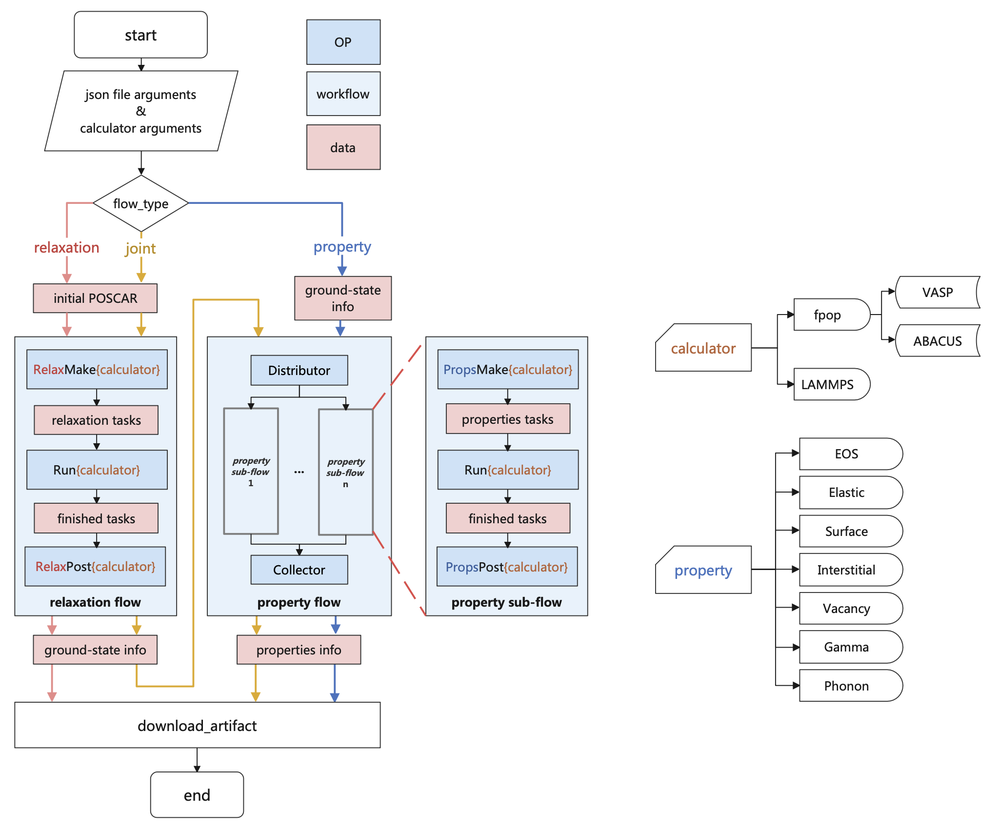

# APEX: Alloy Property EXplorer using simulations

[APEX](https://github.com/deepmodeling/APEX): Alloy Property EXplorer using simulations, is a component of the [AI Square](https://aissquare.com/) project that involves the restructuring of the [DP-Gen](https://github.com/deepmodeling/dpgen) `auto_test` module to develop a versatile and extensible Python package for general alloy property testing. This package enables users to conveniently establish a wide range of property-test workflows by utilizing various computational approaches, including support for LAMMPS, VASP, and ABACUS.

## Table of Contents

- [APEX: Alloy Property EXplorer using simulations](#apex-alloy-property-explorer-using-simulations)
  - [Table of Contents](#table-of-contents)
  - [1. Overview](#1-overview)
  - [2. Easy Install](#2-easy-install)
  - [3. User Guide](#3-user-guide)
    - [3.1. Input Files Preperation](#31-input-files-preperation)
      - [3.1.1. Global Setting](#311-global-setting)
      - [3.1.2. Calculation Parameters](#312-calculation-parameters)
        - [3.1.2.1. Gamma Line Settings](#3121-gamma-line-settings)
    - [3.2. Submittion Command](#32-submittion-command)
  - [4. Quick Start](#4-quick-start)
    - [4.1. In the Bohrium](#41-in-the-bohrium)
    - [4.2. In a Local Argo Service](#42-in-a-local-argo-service)
    - [4.3. In a Local Environment](#43-in-a-local-environment)

## 1. Overview

APEX adopts the functionality of the second-generation alloy properties calculations and is developed utilizing the [dflow](https://github.com/deepmodeling/dflow) framework. By integrating the benefits of cloud-native workflows, APEX streamlines the intricate procedure of automatically testing various configurations and properties. Owing to its cloud-native characteristic, APEX provides users with a more intuitive and user-friendly interaction, enhancing the overall user experience by eliminating concerns related to process control, task scheduling, observability, and disaster tolerance.

The comprehensive architecture of APEX is demonstrated below:

<div>
    
    <p style='font-size:1.0rem; font-weight:none'>Figure 1. APEX schematic diagram</p>
</div>

APEX consists of three pre-defined **workflows** that users can submit: `relaxation`, `property`, and `joint` workflows. The relaxation and property workflows comprise three sequential **sub-steps**: `Make`, `Run`, and `Post`. The `joint` workflow essentially combines the `relaxation` and `property` workflows into a comprehensive workflow.

The `relaxation` process begins with the initial `POSCAR` supplied by the user, which is used to generate crucial data such as the final relaxed structure and its corresponding energy, forces, and virial tensor. This equilibrium state information is essential for input into the `property` workflow, enabling further calculations of alloy properties. Upon completion, the final results are automatically retrieved and downloaded to the original working directory.

In both the `relaxation` and `property` workflows, the `Make` step prepares the corresponding computational tasks. These tasks are then transferred to the `Run` step, which is responsible for task dispatch, calculation monitoring, and retrieval of completed tasks (implemented through the [DPDispatcher](https://github.com/deepmodeling/dpdispatcher/tree/master) plugin). Upon completion of all tasks, the `Post` step is initiated to gather data and compute the desired property outcomes.

APEX currently offers computation methods for the following alloy properties:

* Equation of State (EOS)
* Elastic constants
* Surface energy
* Interstitial formation energy
* Vacancy formation energy
* Generalized stacking fault energy (Gamma line)

Moreover, APEX supports three types of calculators: **LAMMPS** for molecular dynamics simulations, and **VASP** and **ABACUS** for first-principles calculations.

## 2. Easy Install
Easy install by
```shell
pip install "git+https://github.com/deepmodeling/APEX.git"
```
You may also clone the package firstly by
```shell
git clone https://github.com/deepmodeling/APEX.git
```
then install APEX by
```shell
cd APEX
pip install .
```
## 3. User Guide

### 3.1. Input Files Preperation
In APEX, all essential input parameters must be organized in specific JSON files within the **current working directory** before proceeding. There are two distinct types of JSON files that will be discussed in detail.

#### 3.1.1. Global Setting
The instructions regarding global configuration, [dflow](https://github.com/deepmodeling/dflow), and [DPDispatcher](https://github.com/deepmodeling/dpdispatcher/tree/master) specific settings must be saved in JSON format within a file named precisely as `global.json`. The table below describes some crucial keywords, classified into three categories:

* **Dflow**
  | Key words | Data structure | Default | Description |
  | :------------ | ----- | ----- | ------------------- |
  | dflow_host | String | https://127.0.0.1:2746 | Url of dflow server |
  | k8s_api_server | String | https://127.0.0.1:2746 | Url of kubernetes API server |
  | debug_mode | Boolean | False | Whether to run workflow in local debug mode of the dflow. Following `image_name` must be indicated when `debug_mode` is False |
  | apex_image_name | String | None | Image address to run `Make` and `Post` steps. One can build this Docker image via prepared [Dockerfile](./docs/Dockerfile)|
  | dpmd_image_name | String | None | Image address for `Run` step using LAMMPS |
  | vasp_image_name | String | None | Image address for `Run` step using VASP |
  | abacus_image_name | String | None | Image address for `Run` step using ABACUS |
  | lammps_run_command | String | None | Command for `Run` step using LAMMPS|
  | vasp_run_command | String | None | Command for `Run` step using VASP|
  | abacus_run_command | String | None | Command for `Run` step using ABACUS|

* **DPDispatcher** (One may refer to [DPDispatcher’s documentation](https://docs.deepmodeling.com/projects/dpdispatcher/en/latest/index.html) for details of the following parameters)
  | Key words | Data structure | Default | Description |
  | :------------ | ----- | ----- | ------------------- |
  | context_type | String | None | Must be specified at the outermost level if the DPDispather is adopted; Set to `"Bohrium"` to run tasks on the Bohrium |
  | batch_type | String | None | Set to `"Bohrium"` to run tasks on the Bohrium platform |
  | machine | Dict | None | Indication of machine and batch type |
  | resources | Dict | None | Indication of computing recources |
  | task | Dict | None | Indication of run command and essential files |

* **Bohrium** (to be specified when you want to quickly adopt the pre-built dflow service or scientific computing on the [Bohrium platform](https://bohrium.dp.tech) without indicating any **DPDispatcher** related key words)
  | Key words | Data structure | Default | Description |
  | :------------ | ----- | ----- | ------------------- |
  | s3_repo_key | String | None | Key of artifact repository. Set to `"oss-bohrium"` when adopt dflow servise on Bohrium |
  | s3_storage_client | String | None | client for plugin storage backend. Set to `"TiefblueClient"` when adopt dflow servise on Bohrium |
  | email | String | None | Email of your Bohrium account |
  | password | String | None | Password of your Bohrium account |
  | program_id | Int | None | Program ID of your Bohrium account |
  | cpu_scass_type | String | None | CPU node type on Bohrium to run the first-principle jobs |
  | gpu_scass_type | String | None | GPU node type on Bohrium to run LAMMPS jobs |

Please refer to the [Quick Start](#4-quick-start) section for various instances of `global.json` usage in different situations.

#### 3.1.2. Calculation Parameters
The method for indicating parameters in alloy property calculations is akin to the previous `dpgen.autotest` approach. There are **three** categories of JSON files that determine the parameters to be passed to APEX, based on their contents. Users have the flexibility to assign any name to these files.

Categories calculation parameter files:
| Type | File format | Dictionary contained | Usage |
| :------------ | ---- | ----- | ------------------- |
| Relaxation | json | `structures`; `interaction`; `Relaxation` | For `relaxation` worflow |
| Property | json |  `structures`; `interaction`; `Properties`  | For `property` worflow |
| Joint | json |  `structures`; `interaction`; `Relaxation`; `Properties` | For `relaxation`, `property` and `joint` worflow |

It should be noted that files such as POSCAR, located within the `structure` directory, or any other files specified within the JSON file, must be pre-prepared in the current working directory.

Below are three examples (for detailed explanations of each parameter, please refer to the [Hands-on_auto-test](./docs/Hands_on_auto-test.pdf) documentation for further information):

* **Relaxation parameter file**
  ```json
  {
    "structures":            ["confs/std-*"],
    "interaction": {
            "type":           "deepmd",
            "model":          "frozen_model.pb",
            "type_map":       {"Mo": 0}
	  },
    "relaxation": {
            "cal_setting":   {"etol":       0,
                              "ftol":     1e-10,
                              "maxiter":   5000,
                              "maximal":  500000}
	  }
  }
  ```
* **Property parameter file**
  ```json
  {
    "structures":    ["confs/std-*"],
    "interaction": {
        "type":          "deepmd",
        "model":         "frozen_model.pb",
        "type_map":      {"Mo": 0}
    },
    "properties": [
        {
          "type":         "eos",
          "skip":         false,
          "vol_start":    0.6,
          "vol_end":      1.4,
          "vol_step":     0.1,
          "cal_setting":  {"etol": 0,
                          "ftol": 1e-10}
        },
        {
          "type":         "elastic",
          "skip":         false,
          "norm_deform":  1e-2,
          "shear_deform": 1e-2,
          "cal_setting":  {"etol": 0,
                          "ftol": 1e-10}
        }
        ]
  }
  ```
* **Joint parameter file**
  ```json
  {
    "structures":            ["confs/std-*"],
    "interaction": {
          "type":           "deepmd",
          "model":          "frozen_model.pb",
          "type_map":       {"Mo": 0}
      },
    "relaxation": {
            "cal_setting":   {"etol":       0,
                            "ftol":     1e-10,
                            "maxiter":   5000,
                            "maximal":  500000}
      },
    "properties": [
      {
        "type":         "eos",
        "skip":         false,
        "vol_start":    0.6,
        "vol_end":      1.4,
        "vol_step":     0.1,
        "cal_setting":  {"etol": 0,
                        "ftol": 1e-10}
      },
      {
        "type":         "elastic",
        "skip":         false,
        "norm_deform":  1e-2,
        "shear_deform": 1e-2,
        "cal_setting":  {"etol": 0,
                        "ftol": 1e-10}
      }
      ]
  }
  ```
##### 3.1.2.1. Gamma Line Settings
  <div>
      
      <p style='font-size:1.0rem; font-weight:none'>Figure 2. Schematic diagram of Gamma line calculation</p>
  </div>

The Gamma line (stacking fault energy) function of APEX calculates energy of a series slab structures of specific crystal plane, which displaced in the middle along a slip vector as illustrated in **Figure 2**. In APEX, the slab structrures are defined by a plane miller index and two orthogonal directions (primary and secondary) on the plane. The **slip vector** is then defined by unit vectors along those two directions with unit length of the relaxed lattice parameter **$a$**.

APEX now support most common slip systems in respect to FCC, BCC and HCP crystal structures. Key information is listed below:
* FCC
  | Plane miller index | Primary direction | Secondary direction | Default slip vector |
  | :-------- | ----- | ----- | ---- |
  | $(001)$ | $[100]$ | $[010]$ | $(a,0)$ |
  | $(110)$ | $[\bar{1}10]$ | $[001]$ | $(\sqrt{2}a,0)$ |
  | $(111)$ | $[11\bar{2}]$ | $[\bar{1}10]$ | $(\sqrt{6}a,0)$ |
  | $(111)$ | $[\bar{1}\bar{1}2]$ | $[1\bar{1}0]$ | $(\sqrt{6}a,0)$ |
  | $(111)$ | $[\bar{1}10]$ | $[1\bar{1}\bar{1}2]$ | $(\sqrt{2}a,0)$ |
  | $(111)$ | $[1\bar{1}0]$ | $[11\bar{2}]$ | $(\sqrt{2}a,0)$ |

* BCC
  | Plane miller index | Primary direction | Secondary direction | Default slip vector |
  | :-------- | ----- | ----- | ---- |
  | $(001)$ | $[100]$ | $[010]$ | $(a, 0)$ |
  | $(111)$ | $[\bar{1}10]$ | $[\bar{1}\bar{1}2]$ | $(\frac{\sqrt{2}}{2}a,0)$ |
  | $(110)$ | $[\bar{1}11]$ | $[001]$ | $(\frac{\sqrt{3}}{2}a,0)$ |
  | $(110)$ | $[1\bar{1}\bar{1}]$ | $[00\bar{1}]$ | $(\frac{\sqrt{3}}{2}a, 0)$ |
  | $(112)$ | $[11\bar{1}]$ | $[\bar{1}10]$ | $(\frac{\sqrt{3}}{2}a,0)$ |
  | $(112)$ | $[\bar{1}\bar{1}1]$ | $[1\bar{1}0]$ | $(\frac{\sqrt{3}}{2}a,0)$ |
  | $(123)$ | $[11\bar{1}]$ | $[\bar{2}10]$ | $(\frac{\sqrt{3}}{2}a,0)$ |
  | $(123)$ | $[\bar{1}\bar{1}1]$ | $[2\bar{1}0]$ | $(\frac{\sqrt{3}}{2}a,0)$ |

* HCP (Bravais lattice)
  | Plane miller index | Primary direction | Secondary direction | Default slip vector |
  | :-------- | ----- | ----- | ---- |
  | $(0001)$ | $[2\bar{1}\bar{1}0]$ | $[01\bar{1}0]$ |  |
  | $(0001)$ | $[1\bar{1}00]$ | $[01\bar{1}0]$ |  |
  | $(0001)$ | $[10\bar{1}0]$ | $[01\bar{1}0]$ |  |
  | $(01\bar{1}0)$ | $[\bar{2}110]$ | $[0001]$ |  |
  | $(01\bar{1}0)$ | $[\bar{2}113]$ | $[0001]$ |  |
  | $(\bar{1}2\bar{1}0)$ | $[\bar{1}010]$ | $[0001]$ |  |
  | $(01\bar{1}1)$ | $[\bar{2}110]$ | $[1\bar{2}13]$ |  |
  | $(01\bar{1}1)$ | $[1\bar{2}13]$ | $[2\bar{1}\bar{1}0]$ |  |
  | $(01\bar{1}1)$ | $[0\bar{1}12]$ | $[1\bar{2}13]$ |  |
  | $(\bar{1}2\bar{1}2)$ | $[\bar{1}010]$ | $[1\bar{2}13]$ |  |
  | $(\bar{1}2\bar{1}2)$ | $[1\bar{2}13]$ | $[10\bar{1}0]$ |  |

The parameters related to Gamma line calculation are listed below:
  | Key words | Data structure | Default | Description |
  | :------------ | ----- | ----- | ------------------- |
  | plane_miller | list[int] | None | Miller index of the target slab |
  | primary_direction | list[int] | None | Miller index of primary direction of the slab |
  | plane_slip_vector | list[int] | According to specific slip system as above tables show | Slip vector defined by unit vector along primary and secondary directions (unit length equals to relaxed lattice parameter $a$). Only to be specified when differs from the default value|
  | n_steps | int | 10 | Number of steps to displace slab along the slip vector  |
  | min_vacuum_size | int | 0 | Minimal number of vacuum layer added to the slab |
  | supercell_size | list[int] | [1, 1, 5] | Size of generated supper cell based on slab structure |
  | add fix | list[str] | ["true","true","false"] | If add fix position constrain along x, y and z direction during calculation |

  Here is an example:
  ```json
  {
    "type":            "gamma",
    "skip":            false,
    "plane_miller":     [0,0,1],
    "primary_direction":  [1,0,0],
    "fcc": {
            "plane_miller":      [1,1,1],
            "primary_direction": [1,1,-2],
            },
    "hcp": {
            "plane_miller":      [0,0,0,1],
            "primary_direction": [2,-1,-1,0],
            "plane_slip_vector": [1, 1] 
            },
    "supercell_size":   [1,1,10],
    "min_vacuum_size": 0,
    "add_fix": ["true","true","false"], 
    "n_steps":    10
  }
  ```
  Note that for different types of crystal structure, user can further specify `plane_miller`, `primary_direction` and `plane_slip_vector` inside corresponding nested dictionary, where APEX will try to get those values in the first place.


### 3.2. Submittion Command
APEX will execute a specific workflow upon each invocation of the command in the format: `apex [file_names] [--optional_argument]`. The type of workflow and calculation method will be automatically determined by APEX based on the parameter file provided by the user. Additionally, users can specify the workflow type through an optional argument. The following are command examples for submitting three types of workflows:

* `relaxtion` workflow:
  ```shell
  apex relaxation.json
  ```
   ```shell
  apex joint.json --relax
  ```
   ```shell
  apex relaxation.json property.json --relax
  ```
* `property` workflow:
  ```shell
  apex property.json
  ```
  ```shell
  apex joint.json --props
  ```
  ```shell
  apex relaxation.json property.json --props
  ```
* `joint` workflow:
  ```shell
  apex joint.json
  ```
  ```shell
  apex property.json relaxation.json
  ```
APEX also provides a **single-step local debug mode**, which can run `Make` and `Post` step individually under local enviornment. User can invoke them by following optional arguments like:

  | Type of step | Optional argument | Shorten way |
  | :------------ | ----- | ----- |
  | `Make` of `relaxation` | `--make_relax` | `-mr` | 
  | `Post` of `relaxation` | `--post_relax` | `-pr` | 
  | `Make` of `property` | `--make_props` | `-mp` | 
  | `Post` of `proterty` | `--post_props` | `-pp` | 

## 4. Quick Start
We present several case studies as introductory illustrations of APEX, tailored to distinct user scenarios. For our demonstration, we will utilize a [LAMMPS_example](./examples/lammps_demo) to compute the Equation of State (EOS) and elastic constants of molybdenum in both Body-Centered Cubic (BCC) and Face-Centered Cubic (FCC) phases. To begin, we will examine the files prepared within the working directory for this specific case.

```
lammps_demo
├── confs
│   ├── std-bcc
│   │   └── POSCAR
│   └── std-fcc
│       └── POSCAR
├── frozen_model.pb
├── global.json
├── param_joint.json
├── param_props.json
└── param_relax.json
```
There are three type of parameter files and the `global.json`, as well as a force-field potential file of molybdenum `frozen_model.pb`. Under the directory of `confs`, structure file `POSCAR` of both phases have been prepared respectively.

### 4.1. In the Bohrium
The most efficient method for submitting an APEX workflow is through the preconfigured execution environment of dflow on the [Bohrium platform](https://bohrium.dp.tech). To do this, it may be necessary to create an account on Bohrium. Below is an example of a global.json file for this approach.

```json
{
    "dflow_host": "https://workflows.deepmodeling.com",
    "k8s_api_server": "https://workflows.deepmodeling.com",
    "s3_repo_key": "oss-bohrium",
    "s3_storage_client": "TiefblueClient",
    "email": "YOUR_EMAIL",
    "password": "YOUR_PASSWD",
    "program_id": 1234,
    "apex_image_name":"registry.dp.tech/dptech/prod-11045/apex-dependencies:0.0.3",
    "dpmd_image_name": "registry.dp.tech/dptech/prod-11045/deepmd-kit:deepmd-kit2.1.1_cuda11.6_gpu",
    "lammps_run_command":"lmp -in in.lammps",
    "batch_type": "Bohrium",
    "context_type": "Bohrium",
    "cpu_scass_type":"c4_m8_cpu",
    "gpu_scass_type":"c8_m31_1 * NVIDIA T4"
}
```
Just replace the values of `email`, `password` and `program_id` of your own before submit. As for image used, you can either built your own or use public images from Bohrium or pulling from the Docker Hub. Once the workflow is submitted, one can monitor it on https://workflows.deepmodeling.com.

### 4.2. In a Local Argo Service
Additionally, a dflow environment can be constructed on a local computer by executing [installation scripts](https://github.com/deepmodeling/dflow/tree/master/scripts) located in the dflow repository. For instance, to install on a Linux system without root access:
```shell
bash install-linux-cn.sh
```
This process will automatically configure the required local tools, including Docker, Minikube, and Argo service, with the default port set to `127.0.0.1:2746`. Consequently, one can modify the `global.json` file to submit a workflow to this container without needing a Bohrium account.

```json
{
    "apex_image_name": "zhuoyli/apex:amd64",
    "dpmd_image_name": "deepmodeling/deepmd-kit:2.2.1_cuda10.1_gpu",
    "lammps_run_command": "lmp -in in.lammps",
    "context_type": "SSHContext",
    "machine": {
        "batch_type": "Slurm",
        "context_type": "SSHContext",
        "local_root" : "/home/user123/workplace/22_new_project/",
        "remote_root": "/home/user123/dpdispatcher_work_dir/",
        "remote_profile": {
            "hostname": "39.106.xx.xxx",
            "username": "user123",
            "port": 22,
            "timeout": 10
            }
    }
}
```
In this example, we attempt to distribute tasks to a remote node managed by [Slurm](https://slurm.schedmd.com). Users must replace the relevant parameters within the `machine` dictionary or specify `resources` and `tasks` according to [DPDispatcher](https://docs.deepmodeling.com/projects/dpdispatcher/en/latest/index.html) rules.

For the APEX image, it is publicly available on [Docker Hub](https://hub.docker.com) and can be pulled automatically. Users may also choose to pull the image beforehand or create their own Docker image in the Minikube environment locally using a [Dockerfile](./docs/Dockerfile) (please refer to [Docker's documentation](https://docs.docker.com/engine/reference/commandline/build/) for building instructions) to expedite pod initialization.

Upon submission of the workflow, progress can be monitored at https://127.0.0.1:2746.

### 4.3. In a Local Environment
If your local computer experiences difficulties connecting to the internet, APEX offers a **workflow local debug mode** that allows the flow to operate in a basic `Python3` environment, independent of the Docker container. However, users will **not** be able to monitor the workflow through the Argo UI.

To enable this feature, users can set `debug_mode` to `true` within `global.json`, as demonstrated below:

```json
{
    "debug_mode": true,
    "lammps_run_command": "lmp -in in.lammps",
    "context_type": "SSHContext",
    "machine": {
        "batch_type": "Slurm",
        "context_type": "SSHContext",
        "local_root" : "/home/user123/workplace/22_new_project/",
        "remote_root": "/home/user123/dpdispatcher_work_dir/",
        "remote_profile": {
            "hostname": "39.106.xx.xxx",
            "username": "user123",
            "port": 22,
            "timeout": 10
            }
    }
}
```
In this approach, the user is not required to specify an image for executing APEX. Rather, APEX should be pre-installed in the default `Python3` environment to ensure proper functioning.
