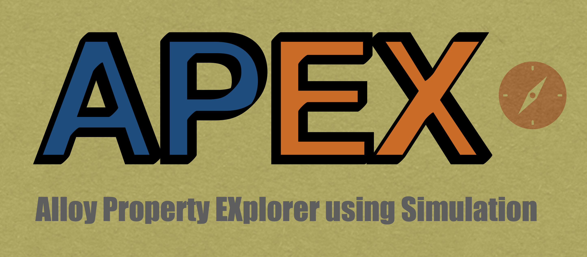
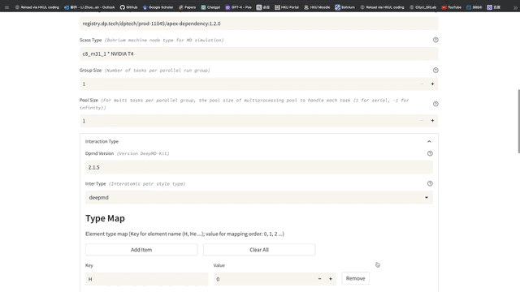
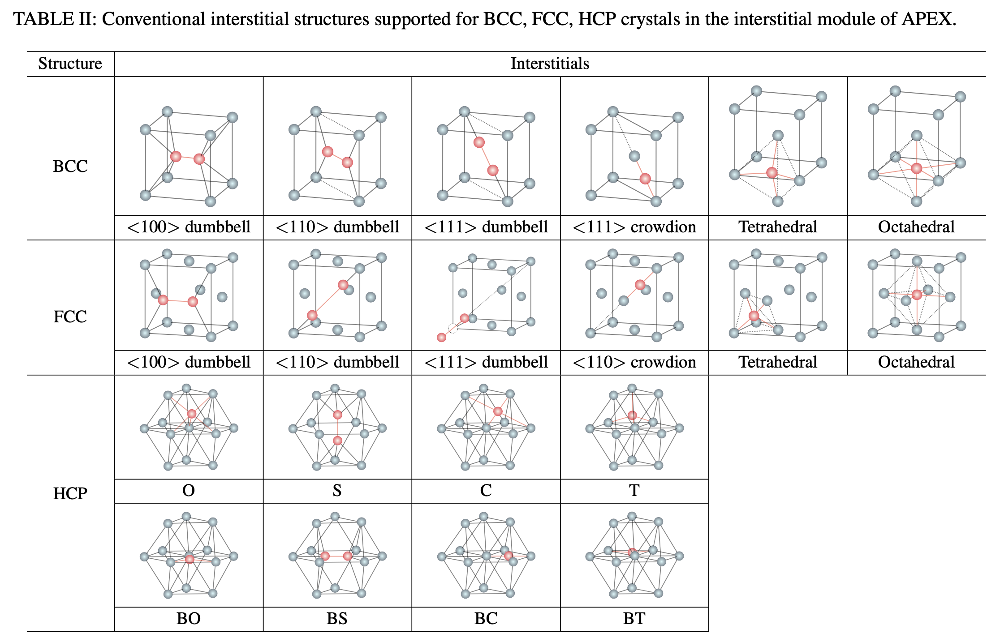
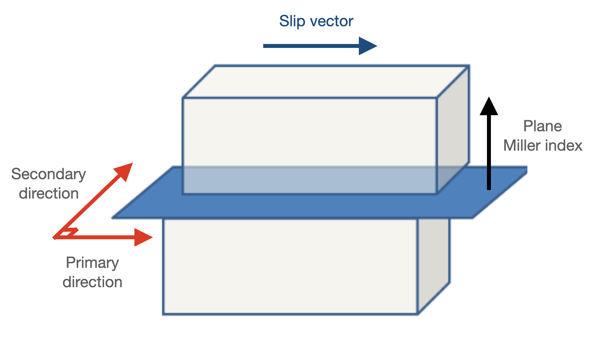

<div style="text-align: center;">
    
</div>

# APEX: Alloy Property EXplorer
[](https://github.com/deepmodeling/APEX)

[APEX](https://github.com/deepmodeling/APEX) helps materials scientists build reliable alloy property workflows that run on local machines, on-premises clusters, or the Bohrium cloud. It refactors the [DP-GEN](https://github.com/deepmodeling/dpgen) `auto_test` module into a flexible, dflow-powered Python package that prepares tasks, dispatches calculations, monitors progress, and collects results for calculators such as **LAMMPS**, **VASP**, and **ABACUS**.



## What's Inside
- [Quickstart: Submit Your First APEX Job](#quickstart-submit-your-first-apex-job)
- [Installation Options](#installation-options)
- [Execution Backends](#execution-backends)
- [Prepare Your Input Files](#prepare-your-input-files)
- [Submit and Monitor Workflows](#submit-and-monitor-workflows)
- [Run Individual Steps](#run-individual-steps)
- [After Submission](#after-submission)
- [Feature Highlights](#feature-highlights)
- [Detailed Parameter Reference](#detailed-parameter-reference)
- [More Resources](#more-resources)

## Quickstart: Submit Your First APEX Job

Follow these five steps to run the bundled LAMMPS demo (`examples/lammps_demo`) and understand the full submission flow.

1. **Install APEX**

   ```shell
   pip install apex-flow
   ```

   Or install from source:

   ```shell
   git clone https://github.com/deepmodeling/APEX.git
   cd APEX
   pip install .
   ```

2. **Grab the example workspace**

   If you installed from PyPI, clone the repository to access the ready-to-run examples:

   ```shell
   git clone https://github.com/deepmodeling/APEX.git
   cd APEX/examples/lammps_demo
   ```

   (When installing from source you already have these files under `examples/`.) The directory contains structure files, parameter JSON files, and a Deep Potential model.

3. **Tell APEX where to run**

   Pick the backend that matches your environment and adjust the corresponding global configuration file:

   - **Local debug mode (no Docker/Argo required)**  
     Add the `-d` flag when submitting and keep a minimal global config such as `global_local_debug.json`:

     ```json
     {
         "context_type": "Local",
         "batch_type": "Shell",
         "local_root": "./",
         "run_command": "lmp -in in.lammps"
     }
     ```

     APEX executes every step inside your current Python environment; ensure the necessary executables (LAMMPS, VASP, etc.) are on `PATH`.

   - **Local Argo or on-prem HPC**  
     Use `global_hpc.json` (or create your own) and point it to your scheduler or local Argo service:

     ```json
     {
         "apex_image_name": "zhuoyli/apex_amd64",
         "run_image_name": "zhuoyli/apex_amd64",
         "run_command": "lmp -in in.lammps",
         "context_type": "SSHContext",
         "machine": {
             "batch_type": "Slurm",
             "context_type": "SSHContext",
             "local_root": "./",
             "remote_root": "/your/remote/tasks/path",
             "clean_asynchronously": true,
             "remote_profile": {
                 "hostname": "123.12.12.12",
                 "username": "USERNAME",
                 "password": "PASSWD",
                 "port": 22,
                 "timeout": 10
             }
         },
         "resources": {
             "number_node": 1,
             "cpu_per_node": 4,
             "gpu_per_node": 0,
             "queue_name": "apex_test",
             "group_size": 1,
             "module_list": ["deepmd-kit/2.1.0/cpu_binary_release"],
             "custom_flags": [
                 "#SBATCH --partition=xlong",
                 "#SBATCH --ntasks=4",
                 "#SBATCH --mem=10G",
                 "#SBATCH --nodes=1",
                 "#SBATCH --time=1-00:00:00"
             ]
         }
     }
     ```

     Point `dflow_host` and `k8s_api_server` to your Argo endpoint (defaults to `https://127.0.0.1:2746` if you run the local scripts in `docs/scripts/`).

   - **Bohrium cloud (fully managed)**  
     Fill in your credentials inside `global_bohrium.json`:

     ```json
     {
         "dflow_host": "https://workflows.deepmodeling.com",
         "k8s_api_server": "https://workflows.deepmodeling.com",
         "batch_type": "Bohrium",
         "context_type": "Bohrium",
         "email": "YOUR_EMAIL",
         "password": "YOUR_PASSWD",
         "program_id": 1234,
         "apex_image_name": "registry.dp.tech/dptech/prod-11045/apex-dependency:1.2.0",
         "lammps_image_name": "registry.dp.tech/dptech/prod-11045/deepmdkit-phonolammps:2.1.1",
         "lammps_run_command": "lmp -in in.lammps",
         "scass_type": "c8_m31_1 * NVIDIA T4"
     }
     ```

4. **Submit the workflow**

   Run the command from the example directory. Choose the parameter file that matches the workflow you want:

   ```shell
   # Relaxation workflow
   apex submit param_relax.json -c global_hpc.json

   # Property workflow
   apex submit param_props.json -c global_hpc.json

   # Joint (relax + property) workflow
   apex submit param_joint.json -c global_hpc.json
   ```

   Replace `global_hpc.json` with the config for your backend. Add `-d` for local debug mode.

5. **Monitor and collect results**

   - Watch the Argo UI at `https://127.0.0.1:2746` (local) or `https://workflows.deepmodeling.com` (Bohrium). Use SSH port forwarding if the cluster has no direct UI access:  
     ```shell
     ssh -nNT -L 127.0.0.1:2746:127.0.0.1:2746 USERNAME@123.12.12.12
     ```
   - CLI shortcuts: `apex list`, `apex get -i <workflow-id>`, `apex getsteps -i <workflow-id>`.
   - Retrieve outputs manually if necessary:  
     ```shell
     apex retrieve -i <workflow-id> -c global_hpc.json
     ```  
     Results land in your work directory as `all_result.json`. Launch `apex report` for an interactive Dash dashboard.

## Installation Options

- **PyPI (recommended for most users)**  
  ```shell
  pip install apex-flow
  ```

- **From source (latest features / development)**  
  ```shell
  git clone https://github.com/deepmodeling/APEX.git
  cd APEX
  pip install .
  ```

## Execution Backends

APEX builds on [dflow](https://github.com/deepmodeling/dflow) to orchestrate cloud-native workflows. Choose the backend that matches your infrastructure:

- **Local debug (`apex submit -d`)**: Run everything on your workstation without Docker or Argo. Good for quick validation and debugging scripts.
- **Local Argo on Minikube**: Use `docs/scripts/install-linux-cn.sh` (Unix-like) to bootstrap Docker, Minikube, and Argo with the UI on `127.0.0.1:2746`. See the [dflow tutorials](https://github.com/deepmodeling/dflow/tree/master/tutorials) for Windows setup.
- **Remote HPC via DPDispatcher**: Define SSH credentials, scheduler options, and resource requirements inside your global config. APEX hands off the `run` step to DPDispatcher to submit jobs to Slurm or other supported schedulers.
- **Bohrium cloud**: Leverage the managed Argo service and curated container images on [Bohrium](https://bohrium.dp.tech). You only need valid account credentials and program ID.

## Prepare Your Input Files

Every submission needs three pieces:

- **Global configuration (`global*.json`)**: dflow, container, and dispatcher settings.
- **Calculation parameters (`param*.json`)**: structures, calculator inputs, and target properties.
- **Work directory**: structure files, potential files, and any resources referenced by the parameter JSON (paths are relative to this directory).

Example layout (`examples/lammps_demo`):

```
lammps_demo
├── confs
│   ├── std-bcc
│   │   └── POSCAR
│   └── std-fcc
│       └── POSCAR
├── frozen_model.pb
├── global_bohrium.json
├── global_hpc.json
├── machine_hpc.json
├── param_joint.json
├── param_props.json
└── param_relax.json
```

### Calculation parameter file types

| Type | File format | Required dictionaries | Typical use |
|------|-------------|-----------------------|-------------|
| Relaxation (`param_relax.json`) | JSON | `structures`, `interaction`, `relaxation` | Prepare equilibrium structures |
| Property (`param_props.json`) | JSON | `structures`, `interaction`, `properties` | Evaluate selected properties |
| Joint (`param_joint.json`) | JSON | `structures`, `interaction`, `relaxation`, `properties` | Run relaxation followed by properties |

Paths in these files should be relative to the work directory. The examples above cover standard Deep Potential workflows; see `docs/Hands_on_auto-test.pdf` for a complete walk-through.

## Submit and Monitor Workflows

APEX chooses the workflow type from the parameter files you provide:

```shell
apex submit [-h] [-c CONFIG] [-w WORK [WORK ...]] [-d] [-s] [-f {relax,props,joint}] parameter [parameter ...]
```

- `parameter`: one or more calculation JSON files (joint workflows accept both relax and property files).
- `-c`: path to the global config (`./global.json` by default).
- `-w`: override work directories (defaults to current directory).
- `-d`: run in local debug mode (no containers).
- `-s`: submit only, skip auto result retrieval.
- `-f`: force workflow type when inferring from parameters is not desired.

Common management commands:

| Command | Purpose |
|---------|---------|
| `apex list` | List workflows visible to the configured dflow service. |
| `apex get -i <id>` | Inspect workflow metadata. |
| `apex getsteps -i <id>` | Inspect step-by-step status. |
| `apex getkeys -i <id>` | List step keys. |
| `apex delete -i <id>` | Remove a workflow. |
| `apex resubmit -i <id>` | Resubmit a workflow with the same settings. |
| `apex retry -i <id>` | Retry failed steps. |
| `apex resume -i <id>` | Resume a suspended workflow. |
| `apex stop -i <id>` / `apex suspend -i <id>` / `apex terminate -i <id>` | Control workflow execution. |

## Run Individual Steps

For fine-grained debugging you can execute single steps locally via `apex do`:

1. Generate tasks:
   ```shell
   apex do param_relax.json make_relax
   ```
2. Dispatch tasks (specify machine settings in a separate JSON if needed):
   ```shell
   apex do param_relax.json run_relax -c machine_hpc.json
   ```
3. Post-process results:
   ```shell
   apex do param_relax.json post_relax
   ```

The same pattern applies to property calculations (`make_props`, `run_props`, `post_props`).

## After Submission

- **Manual retrieval**  
  ```shell
  apex retrieve [-h] [-i ID] [-w WORK] [-c CONFIG]
  ```
  Useful when automatic retrieval is disabled (`-s`) or fails.

- **Archive results**  
  ```shell
  apex archive [parameters ...]
  ```
  Sync the latest property data into `all_result.json`, or push to MongoDB / DynamoDB by setting `database_type` in your global config. Use `apex archive -h` for details.

- **Interactive reports**  
  ```shell
  apex report -w WORKDIR [WORKDIR ...]
  ```
  Launch a Dash app (http://127.0.0.1:8050/) to explore multiple result sets side-by-side.

## Feature Highlights

**What’s new in v1.2**

- Added `retrieve` sub-command for manual result downloads (replaces Distributor/Collector operators).
- Command-line access to common dflow operations (`list`, `get`, `stop`, etc.).
- Result archiving to local files, MongoDB, or DynamoDB.
- Introduced `report` sub-command for Dash-based visualisation and comparison.
- Automated band-path detection via [SeeK-path](https://seekpath.readthedocs.io/en/latest/index.html) in phonon workflows.
- Eight predefined HCP interstitial configurations.
- New LAMMPS interaction types: ML pair styles (`snap`, `gap`, `rann`, `mace`) and `meam-spline`.
- Renamed the single-step command from `test` to `do` for clarity.

## Detailed Parameter Reference

### Global configuration (`global*.json`)

#### Basic config

| Key | Type | Default | Description |
|-----|------|---------|-------------|
| `apex_image_name` | String | `zhuoyli/apex_amd64` | Image for steps other than `run`. Build from `docs/Dockerfile` if customising. |
| `run_image_name` | String | `None` | Calculator image for the `run` step. Overrides `{calculator}_image_name` if both present. |
| `run_command` | String | `None` | Command executed in the `run` step. Use `{calculator}_run_command` for calculator-specific overrides. |
| `group_size` | Integer | `1` | Number of tasks grouped per parallel run. |
| `pool_size` | Integer | `1` | Multiprocessing pool size when multiple tasks run locally (set `-1` for unlimited). |
| `upload_python_package` | List[String] | `None` | Extra Python packages to upload into the container. |
| `debug_pool_workers` | Integer | `1` | Pool size when executing in debug mode (`-d`). |
| `flow_name` | String | `None` | Custom workflow name (defaults to work directory name). |
| `submit_only` | Bool | `False` | Submit without auto retrieval. Combine with `apex retrieve` later. |

#### dflow config

| Key | Type | Default | Description |
|-----|------|---------|-------------|
| `dflow_host` | String | `https://127.0.0.1:2746` | dflow service endpoint. |
| `k8s_api_server` | String | `https://127.0.0.1:2746` | Kubernetes API endpoint. |
| `dflow_config` | Dict | `None` | Advanced dflow settings (see [documentation](https://deepmodeling.com/dflow/dflow.html)). |
| `dflow_s3_config` | Dict | `None` | S3 storage configuration passed directly to dflow. |

#### Dispatcher config (via [DPDispatcher](https://docs.deepmodeling.com/projects/dpdispatcher/en/latest/index.html))

| Key | Type | Default | Description |
|-----|------|---------|-------------|
| `context_type` | String | `None` | Dispatcher context (e.g., `SSHContext`, `Bohrium`, `Local`). |
| `batch_type` | String | `None` | Scheduler / batch system (e.g., `Slurm`, `Shell`). |
| `local_root` | String | `./` | Local root directory. |
| `remote_root` | String | `None` | Remote working directory. |
| `remote_host` | String | `None` | Remote host (deprecated in favour of `machine.remote_profile`). |
| `remote_username` | String | `None` | Remote username. |
| `remote_password` | String | `None` | Remote password. |
| `port` | Integer | `22` | SSH port. |
| `machine` | Dict | `None` | Full machine specification (overrides top-level keys). |
| `resources` | Dict | `None` | Resource specification (nodes, queue, modules, etc.). |
| `task` | Dict | `None` | Task specification (command, working directory, environment variables). |

#### Bohrium extras

| Key | Type | Default | Description |
|-----|------|---------|-------------|
| `email` | String | `None` | Bohrium account email. |
| `phone` | String | `None` | Bohrium account phone. |
| `password` | String | `None` | Bohrium password. |
| `program_id` | Integer | `None` | Bohrium program ID. |
| `scass_type` | String | `None` | Bohrium node type. |

### Calculation parameters (`param*.json`)

The JSON schema inherits from `dpgen.autotest`. Below are example snippets for each workflow type:

- **Relaxation**
  ```json
  {
    "structures": ["confs/std-*"],
    "interaction": {
      "type": "deepmd",
      "model": "frozen_model.pb",
      "type_map": {"Mo": 0}
    },
    "relaxation": {
      "cal_setting": {
        "etol": 0,
        "ftol": 1e-10,
        "maxiter": 5000,
        "maximal": 500000
      }
    }
  }
  ```

- **Property**
  ```json
  {
    "structures": ["confs/std-*"],
    "interaction": {
      "type": "deepmd",
      "model": "frozen_model.pb",
      "type_map": {"Mo": 0}
    },
    "properties": [
      {
        "type": "eos",
        "skip": false,
        "vol_start": 0.6,
        "vol_end": 1.4,
        "vol_step": 0.1,
        "cal_setting": {"etol": 0, "ftol": 1e-10}
      },
      {
        "type": "elastic",
        "skip": false,
        "norm_deform": 1e-2,
        "shear_deform": 1e-2,
        "cal_setting": {"etol": 0, "ftol": 1e-10}
      }
    ]
  }
  ```

- **Joint**
  ```json
  {
    "structures": ["confs/std-*"],
    "interaction": {
      "type": "deepmd",
      "model": "frozen_model.pb",
      "type_map": {"Mo": 0}
    },
    "relaxation": {
      "cal_setting": {
        "etol": 0,
        "ftol": 1e-10,
        "maxiter": 5000,
        "maximal": 500000
      }
    },
    "properties": [
      {
        "type": "eos",
        "skip": false,
        "vol_start": 0.6,
        "vol_end": 1.4,
        "vol_step": 0.1,
        "cal_setting": {"etol": 0, "ftol": 1e-10}
      },
      {
        "type": "elastic",
        "skip": false,
        "norm_deform": 1e-2,
        "shear_deform": 1e-2,
        "cal_setting": {"etol": 0, "ftol": 1e-10}
      }
    ]
  }
  ```

#### EOS

| Key | Type | Example | Description |
|-----|------|---------|-------------|
| `vol_start` | Float | `0.9` | Starting volume relative to the relaxed structure. |
| `vol_end` | Float | `1.1` | Ending volume relative to the relaxed structure. |
| `vol_step` | Float | `0.01` | Increment between volume points. |
| `vol_abs` | Bool | `false` | Treat `vol_start` and `vol_end` as absolute volumes when `true`. |

#### Elastic

| Key | Type | Example | Description |
|-----|------|---------|-------------|
| `norm_deform` | Float | `0.01` | Normal strain applied in xx/yy/zz. |
| `shear_deform` | Float | `0.01` | Shear strain applied to off-diagonal components. |
| `conventional` | Bool | `false` | Use the conventional cell for deformation. |
| `ieee` | Bool | `false` | Rotate relaxed structure into IEEE standard orientation. |
| `modulus_type` | String | `"voigt"` | Bulk/shear modulus averaging method (`voigt`, `reuss`, `vrh`). |

#### Surface

| Key | Type | Example | Description |
|-----|------|---------|-------------|
| `min_slab_size` | Integer | `10` | Minimum slab thickness. |
| `min_vacuum_size` | Integer | `11` | Minimum vacuum width. |
| `pert_xz` | Float | `0.01` | Perturbation along xz plane for surface energy. |
| `max_miller` | Integer | `2` | Maximum Miller index considered. |

#### Vacancy

| Key | Type | Example | Description |
|-----|------|---------|-------------|
| `supercell` | List[Int] | `[3, 3, 3]` | Supercell size built around the defect. |

#### Interstitial

| Key | Type | Example | Description |
|-----|------|---------|-------------|
| `insert_ele` | List[String] | `["Al"]` | Elements to insert. |
| `supercell` | List[Int] | `[3, 3, 3]` | Supercell size. |
| `conf_filters` | Dict | `{"min_dist": 1.5}` | Filters to drop invalid configurations. |

<div>
    
</div>

#### Gamma line (generalised stacking fault)

<div style="text-align: center;">
    
    <p style='font-size:1.0rem; font-weight:none'>Schematic of the Gamma line calculation</p>
</div>

APEX generates displaced slab structures from the specified Miller plane and slip directions. The slip vector always follows the primary direction. Use predefined slip systems for FCC, BCC, and HCP crystals when possible to avoid invalid structures.

| Crystal | Plane Miller | Slip direction | Secondary direction | Default slip length |
|---------|--------------|----------------|---------------------|---------------------|
| **FCC** | $(001)$ | $[100]$ | $[010]$ | $a$ |
|         | $(110)$ | $[\bar{1}10]$ | $[001]$ | $\sqrt{2}a$ |
|         | $(111)$ | $[11\bar{2}]$ | $[\bar{1}10]$ | $\sqrt{6}a$ |
|         | $(111)$ | $[\bar{1}\bar{1}2]$ | $[1\bar{1}0]$ | $\sqrt{6}a$ |
|         | $(111)$ | $[\bar{1}10]$ | $[\bar{1}\bar{1}2]$ | $\sqrt{2}a$ |
|         | $(111)$ | $[1\bar{1}0]$ | $[11\bar{2}]$ | $\sqrt{2}a$ |
| **BCC** | $(001)$ | $[100]$ | $[010]$ | $a$ |
|         | $(111)$ | $[\bar{1}10]$ | $[\bar{1}\bar{1}2]$ | $\frac{\sqrt{2}}{2}a$ |
|         | $(110)$ | $[\bar{1}11]$ | $[00\bar{1}]$ | $\frac{\sqrt{3}}{2}a$ |
|         | $(110)$ | $[1\bar{1}\bar{1}]$ | $[001]$ | $\frac{\sqrt{3}}{2}a$ |
|         | $(112)$ | $[11\bar{1}]$ | $[\bar{1}10]$ | $\frac{\sqrt{3}}{2}a$ |
|         | $(112)$ | $[\bar{1}\bar{1}1]$ | $[1\bar{1}0]$ | $\frac{\sqrt{3}}{2}a$ |
|         | $(123)$ | $[11\bar{1}]$ | $[\bar{2}10]$ | $\frac{\sqrt{3}}{2}a$ |
|         | $(123)$ | $[\bar{1}\bar{1}1]$ | $[2\bar{1}0]$ | $\frac{\sqrt{3}}{2}a$ |
| **HCP** | $(0001)$ | $[2\bar{1}\bar{1}0]$ | $[01\bar{1}0]$ | $a$ |
|         | $(0001)$ | $[1\bar{1}00]$ | $[01\bar{1}0]$ | $\sqrt{3}a$ |
|         | $(0001)$ | $[10\bar{1}0]$ | $[01\bar{1}0]$ | $\sqrt{3}a$ |
|         | $(01\bar{1}0)$ | $[\bar{2}110]$ | $[000\bar{1}]$ | $a$ |
|         | $(01\bar{1}0)$ | $[0001]$ | $[\bar{2}110]$ | $c$ |
|         | $(01\bar{1}0)$ | $[\bar{2}113]$ | $[000\bar{1}]$ | $\sqrt{a^2+c^2}$ |
|         | $(\bar{1}2\bar{1}0)$ | $[\bar{1}010]$ | $[000\bar{1}]$ | $\sqrt{3}a$ |
|         | $(\bar{1}2\bar{1}0)$ | $[0001]$ | $[\bar{1}010]$ | $c$ |
|         | $(01\bar{1}1)$ | $[\bar{2}110]$ | $[\bar{1}2\bar{1}\bar{3}]$ | $a$ |
|         | $(01\bar{1}1)$ | $[\bar{1}2\bar{1}\bar{3}]$ | $[2\bar{1}\bar{1}0]$ | $\sqrt{a^2+c^2}$ |
|         | $(01\bar{1}1)$ | $[0\bar{1}12]$ | $[\bar{1}2\bar{1}\bar{3}]$ | $\sqrt{3a^2+4c^2}$ |
|         | $(\bar{1}2\bar{1}2)$ | $[10\bar{1}0]$ | $[1\bar{2}13]$ | $\sqrt{3}a$ |
|         | $(\bar{1}2\bar{1}2)$ | $[1\bar{2}13]$ | $[\bar{1}010]$ | $\sqrt{a^2+c^2}$ |

Key parameters:

| Key | Type | Default | Description |
|-----|------|---------|-------------|
| `plane_miller` | Sequence[Int] | `None` | Miller indices of the target plane. |
| `slip_direction` | Sequence[Int] | `None` | Primary slip direction. |
| `slip_length` | Float or Sequence | `1` | Slip magnitude (vector format `[x, y, z]` means $\sqrt{(xa)^2 + (yb)^2 + (zc)^2}$). |
| `plane_shift` | Float | `0` | Shift of the displacement plane in units of lattice parameter `c`. |
| `n_steps` | Integer | `10` | Number of sampling points along the slip. |
| `vacuum_size` | Float | `0` | Added vacuum layer thickness (Å). |
| `supercell_size` | Sequence[Int] | `[1, 1, 5]` | Slab supercell size. |
| `add_fix` | Sequence[String] | `["true","true","false"]` | Position constraints along x/y/z. |

Example:

```json
{
  "type": "gamma",
  "skip": true,
  "plane_miller": [0, 0, 1],
  "slip_direction": [1, 0, 0],
  "hcp": {
    "plane_miller": [0, 1, -1, 1],
    "slip_direction": [-2, 1, 1, 0],
    "slip_length": [1, 0, 1],
    "plane_shift": 0.25
  },
  "supercell_size": [1, 1, 6],
  "vacuum_size": 10,
  "add_fix": ["true", "true", "false"],
  "n_steps": 10
}
```

Nested dictionaries (`fcc`, `bcc`, `hcp`, etc.) override the top-level parameters for the corresponding lattice type.

#### Phonon spectra

APEX integrates parts of [dflow-phonon](https://github.com/Chengqian-Zhang/dflow-phonon) and wraps [Phonopy](https://github.com/phonopy/phonopy) / [phonoLAMMPS](https://github.com/abelcarreras/phonolammps). [SeeK-path](https://seekpath.readthedocs.io/en/latest/index.html) automatically generates high-symmetry k-paths.

> **Important:** Ensure the `run_image` (or local environment in debug mode) contains `phonoLAMMPS` when running LAMMPS-based phonon workflows.

| Key | Type | Default | Description |
|-----|------|---------|-------------|
| `primitive` | Bool | `false` | Reduce to primitive cell before phonon calculation. |
| `approach` | String | `"linear"` | VASP phonon method: `"linear"` or `"displacement"`. |
| `supercell_size` | Sequence[Int] | `[2, 2, 2]` | Supercell dimensions. |
| `MESH` | Sequence[Int] | `None` | Reciprocal-space mesh (e.g., `[8, 8, 8]`). |
| `PRIMITIVE_AXES` | String | `None` | Custom primitive axes definition (`"0.0 0.5 0.5 0.5 0.0 0.5 0.5 0.5 0.0"`). |
| `BAND` | String | `None` | Band path definition (falls back to SeeK-path when omitted). |
| `BAND_LABELS` | String | `None` | Labels for band segments. |
| `BAND_POINTS` | Integer | `51` | Number of sampling points per segment. |
| `BAND_CONNECTION` | Bool | `true` | Enable band connection estimation. |
| `seekpath_from_original` | Bool | `false` | Use `seekpath.get_path_orig_cell` instead of `seekpath.get_path`. |
| `seekpath_param` | Dict | `None` | Extra arguments passed to SeeK-path. |

The linear-response method accelerates calculations for metallic systems, while the finite-displacement approach works with any calculator that can provide forces (e.g., ABACUS).

## More Resources

[](https://bohrium.dp.tech/apps/apex)

- **APEX Bohrium App** – Launch workflows from your browser with minimal configuration (Bohrium account required).
- **Documentation & tutorials** – Explore `docs/Hands_on_auto-test.pdf`, `docs/scripts/`, and the [dflow tutorials](https://github.com/deepmodeling/dflow/tree/master/tutorials) for environment setup.
- **Hands-on Bohrium notebook** – [Interactive tutorial](https://bohrium.dp.tech/notebooks/15413) covering Bohrium submissions.
- **How to cite APEX** –  
  [](https://doi.org/10.1038/s41524-025-01580-y)

  > Li, Z., Wen, T., Zhang, Y. et al. *APEX: an automated cloud-native material property explorer*. npj Comput Mater 11, 88 (2025). https://doi.org/10.1038/s41524-025-01580-y
