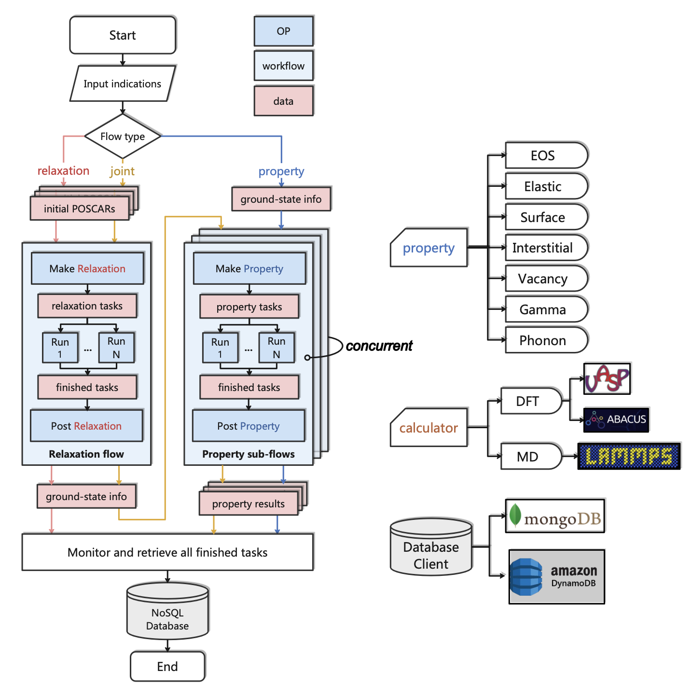

<div style="text-align: center;">
    
</div>

# APEX: Alloy Property EXplorer
[](https://github.com/deepmodeling/APEX)

[1.2.1 Changelog](./CHANGELOG-1.2.1.md)

[APEX](https://github.com/deepmodeling/APEX) helps materials scientists build reliable alloy property workflows that run on local machines, on-premises clusters, or the Bohrium cloud. It refactors the [DP-GEN](https://github.com/deepmodeling/dpgen) `auto_test` module into a flexible, dflow-powered Python package that prepares tasks, dispatches calculations, monitors progress, and collects results for calculators such as **LAMMPS**, **VASP**, and **ABACUS**.


<div style="text-align: center;">
    

</div>

The comprehensive architecture of APEX is demonstrated below:

<div style="text-align: center;">
    
    <p style='font-size:1.0rem; font-weight:none'>Figure 1. Schematic diagram of APEX</p>
</div>


APEX currently offers calculation methods for the following alloy properties:

* Equation of State (EOS)
* Cohesive energy vs. lattice scaling (cohesive energy line)
* Surface energy
* Decohesive energy vs. separation (decohesive energy line)
* Elastic constants
* Vacancy formation energy
* Interstitial formation energy
* Generalized stacking fault energy (Gamma line)
* Phonon spectra
* Grüneisen parameters and thermal expansion
* Finite-temperature lattice parameters (FiniteTlatt)

## What's Inside
- [1. Installation](#1installation)
  - [1.1 Install APEX](#11-install-apex)
- [2. Quick Start](#2-quick-start)
  - [2.1 Work Directory Structure](#21-work-directory-structure)
  - [2.2 Calculation Parameter Files](#22-calculation-parameter-files)
  - [2.3 Global Configuration Files](#23-global-configuration-files)
  - [2.4 Submit Your First Workflow](#24-submit-your-first-workflow)
  - [2.5 Check Your Results](#25-check-your-results)
- [3. User Menu](#3-user-menu)
  - [3.1 Execution Backends](#31-execution-backends)
  - [3.2 Prepare Your Input Files](#32-prepare-your-input-files)
  - [3.3 Calculation Parameter File Types](#33-calculation-parameter-file-types)
  - [3.4 Submit and Monitor Workflows](#34-submit-and-monitor-workflows)
  - [3.5 Run Individual Steps](#35-run-individual-steps)
  - [3.6 After Submission](#36-after-submission)
  - [3.7 Graphical Interface (GUI)](#37-graphical-interface-gui)
  - [3.8 Bohrium Account Defaults](#38-bohrium-account-defaults)
- [4. Detailed Parameter Reference](#4-detailed-parameter-reference)
  - [4.1 Global Configuration](#41-global-configuration-globaljson)
  - [4.2 Calculation Parameters](#42-calculation-parameters-paramjson)
  - [4.3 EOS](#43-eos)
  - [4.4 Cohesive Energy Line](#44-cohesive-energy-line)
  - [4.5 Decohesive Energy Line](#45-decohesive-energy-line)
  - [4.6 Elastic](#46-elastic)
  - [4.7 Surface](#47-surface)
  - [4.8 Vacancy](#48-vacancy)
  - [4.9 Interstitial](#49-interstitial)
  - [4.10 Gamma Line/Surface](#410-gamma-line-generalized-stacking-fault)
  - [4.11 Phonon Spectra](#411-phonon-spectra)
  - [4.12 Grüneisen Parameters and Thermal Expansion](#412-grüneisen-parameters-and-thermal-expansion)
  - [4.13 Finite-Temperature Lattice Parameters](#413-finite-temperature-lattice-parameters)
- [More Resources](#more-resources)

## 1.Installation
### 1.1. Install APEX

There are two ways to install APEX:

#### Option 1: Install from PyPI (recommended for most users)

  ```shell
  pip install apex-flow
  ```
#### Option 2: Install from Source (latest features / development)

  ```shell
  git clone https://github.com/deepmodeling/APEX.git
  cd APEX
  pip install .
  ```


---
## 2. Quick Start

To submit an APEX workflow, you need to organize three essential components in your working directory:

1. **A work directory** with initial structures and computational files
2. **Calculation parameter files** specifying what to compute
3. **Global configuration files** specifying where and how to compute

We present a quick example using a [LAMMPS_example](./examples/lammps/lammps_tutorial1_quick_start/lammps_example1.1_Mo) to compute the Equation of State (EOS) and elastic constants of molybdenum (Mo) metal in both Body-Centered Cubic (BCC) phase.

### 2.1. Work Directory Structure

Create your working directory with the following structure:

```
lammps_demo/
├── confs/
│   ├── std-bcc/
│       └── POSCAR
├── frozen_model.pb
├── global_bohrium.json
└── param_joint.json
```

**Directory Organization:**

- **`confs/` subdirectory**: Contains initial crystal structures in POSCAR format for different phases (BCC, FCC). These are the starting geometries for your calculations. To compute the properties of Mo in BCC/FCC phases, you can download the corresponding POSCAR files from [Materials Project](https://next-gen.materialsproject.org/materials/mp-129?formula=Mo).

- **`frozen_model.pb`**: The machine learning potential model file (or other force field files). This is the pre-trained model used to perform the calculations.

- **`param_*.json` files**: Specify the computational requirements:
  - `param_joint.json` - Parameters for structure relaxation and property calculations


- **`global_bohrium.json`**: Provides computing resource information for Bohrium cloud platform execution.

### 2.1.1 Random Solid Solution (RSS) Generation

APEX provides a pseudo Monte Carlo sampler to generate random solid solutions
with user-defined Warren-Cowley short-range order (SRO) targets.

Run RSS generation with:

```bash
apex rss rss.json
```

#### Required input structure definition

In `rss.json`, provide one of the following:

- `parent_structure`: path to an existing structure file (typically POSCAR)
- `parent_lattice`: programmatic parent lattice definition

Example `parent_lattice`:

```json
{
  "parent_lattice": {
    "type": "B2",
    "a": "auto",
    "supercell": "auto"
  },
  "composition_tolerance": 0.001,
  "supercell_shape": "near_cubic",
  "maxmium_nums_atoms": 128
}
```

Current supported `parent_lattice.type`:
`fcc`, `bcc`, `sc`, `hcp`, `diamond`, `B2`, `L12`, `L10`.

#### Key RSS parameters

- `supercell` (`array[int, int, int]`): expands the loaded/built parent structure.
  If you also set `parent_lattice.supercell`, both expansions are applied.
- `output_structure` (`string`): output root directory for generated
  configurations. Default is `RSS`. Each generated structure is written to a
  separate `conf_###/POSCAR` directory, such as `conf_001/POSCAR`.
- `compositions` (`object`): species fractions per sublattice.
  Fractions within each sublattice must sum to `1.0`.

Commonly used controls:

- `sro_targets`, `shell_cutoffs`, `shell_weights`
- `max_steps`, `temperature`, `tol`, `patience`
- `num_configs`, `interval`, `seed`, `metadata`, `show_progress`

For a complete key-by-key reference and runnable examples, see
`examples/rss/README.md`.


### 2.2. Calculation Parameter Files

Calculation parameter files define what properties to compute and with what parameters.

#### Joint Parameter File

This file contains parameters for geometry optimization, structure relaxation and property calculations:

<span style="color: red">**Important:** The Json format does not support adding annotations. The annotations provided below are for reference only.</span>
```json
{
  "structures":            ["confs/std-*"],  # Input structure paths
  "interaction": {
    "type":           "deepmd",              # Interaction type
    "model":          "frozen_model.pb",     # Model file path
    "type_map":       {"Mo": 0}              # Element type mapping
  },
  "relaxation": {
    "cal_setting":   {
      "etol":       0,        # Energy tolerance
      "ftol":     1e-10,      # Force tolerance
      "maxiter":   5000,      # Maximum iterations
      "maximal":  500000      # Maximum evaluation steps
    }
  },
  "properties": [
    {
      "type":         "eos",                 # Property type: Equation of State
      "vol_start":    0.6,                   # Starting volume (relative)
      "vol_end":      1.4,                   # End volume (relative)
      "vol_step":     0.1,                   # Volume step
    },
    {
      "type":         "elastic",             # Property type: Elastic constants
    }
  ]
}
```

### 2.3. Global Configuration Files

Global configuration files specify where and how your workflows should be executed.

#### Configuration for Bohrium Cloud Platform

Create `global_bohrium.json` to submit workflows to the Bohrium cloud platform:

```json
{
  "lammps_image_name": "registry.dp.tech/dptech/prod-11045/deepmdkit-phonolammps:2.1.1",
  "lammps_run_command":"lmp -in in.lammps",
  "scass_type":"c8_m31_1 * NVIDIA T4"
}
```

APEX now injects Bohrium defaults automatically (`dflow_host`, `k8s_api_server`, `batch_type`, `context_type`, `apex_image_name`).

Save your Bohrium account once in `~/.apex/account.json`:

```shell
apex account
```

Or set it directly:

```shell
apex account --email YOUR_EMAIL --password YOUR_PASSWD --program-id 1234
```

When running `apex submit -c global_bohrium.json`, values in your json file still have highest priority and override the saved defaults.

### 2.4. Submit Your First Workflow

Once you have prepared all necessary files and configuration, submit your workflow using the Bohrium platform (as shown in the Quick Start example):

```shell
apex submit param_joint.json -c global_bohrium.json
```

Monitor the workflow progress at https://workflows.deepmodeling.com.

### 2.5. Check Your Results
After the job is finished, you can check your results by:

```shell
apex report
```

**For other submission examples, please refer to [Lammps_tutorial](./examples/lammps/apex_lammps_tutorial.md).**


## 3. User menu
### 3.1. Execution Backends

APEX builds on [dflow](https://github.com/deepmodeling/dflow) to orchestrate cloud-native workflows. Choose the backend that matches your infrastructure:

- **Local debug (`apex submit -d`)**: Run everything on your workstation without Docker or Argo. Good for quick validation and debugging scripts.
- **Local Argo on Minikube**: Use `docs/scripts/install-linux-cn.sh` (Unix-like) to bootstrap Docker, Minikube, and Argo with the UI on `127.0.0.1:2746`. See the [dflow tutorials](https://github.com/deepmodeling/dflow/tree/master/tutorials) for Windows setup.
- **Remote HPC via DPDispatcher**: Define SSH credentials, scheduler options, and resource requirements inside your global config. APEX hands off the `run` step to DPDispatcher to submit jobs to Slurm or other supported schedulers.
- **Bohrium cloud**: Leverage the managed Argo service and curated container images on [Bohrium](https://bohrium.dp.tech). You only need valid account credentials and program ID.

### 3.2 Prepare Your Input Files

Every submission needs three pieces:

- **Global configuration (`global*.json`)**: dflow, container, and dispatcher settings.
- **Calculation parameters (`param*.json`)**: structures, calculator inputs, and target properties.
- **Work directory**: structure files, potential files, and any resources referenced by the parameter JSON (paths are relative to this directory).

Example layout (`examples/lammps_demo`):

```
lammps_demo
├── confs
│   ├── std-bcc
│   │   └── POSCAR
│   └── std-fcc
│       └── POSCAR
├── frozen_model.pb
├── global_bohrium.json
├── global_hpc.json
├── machine_hpc.json
├── param_joint.json
├── param_props.json
└── param_relax.json
```

### 3.3 Calculation parameter file types

| Type | File format | Required dictionaries | Typical use |
|------|-------------|-----------------------|-------------|
| Relaxation (`param_relax.json`) | JSON | `structures`, `interaction`, `relaxation` | Prepare equilibrium structures |
| Property (`param_props.json`) | JSON | `structures`, `interaction`, `properties` | Evaluate selected properties |
| Joint (`param_joint.json`) | JSON | `structures`, `interaction`, `relaxation`, `properties` | Run relaxation followed by properties |

Paths in these files should be relative to the work directory. The examples above cover standard Deep Potential workflows; see `docs/Hands_on_auto-test.pdf` for a complete walk-through.

### 3.4 Submit and Monitor Workflows

APEX chooses the workflow type from the parameter files you provide:

```shell
apex submit [-h] [-c CONFIG] [-w WORK [WORK ...]] [-d] [-s] [-f {relax,props,joint}] parameter [parameter ...]
```

- `parameter`: one or more calculation JSON files (joint workflows accept both relax and property files).
- `-c`: path to the global config (`./global.json` by default).
- `-w`: override work directories (defaults to current directory).
- `-d`: run in local debug mode (no containers).
- `-s`: submit only, skip auto result retrieval.
- `-f`: force workflow type when inferring from parameters is not desired.

Common management commands:

| Command | Purpose |
|---------|---------|
| `apex list` | List workflows visible to the configured dflow service. |
| `apex get -i <id>` | Inspect workflow metadata. |
| `apex getsteps -i <id>` | Inspect step-by-step status. |
| `apex getkeys -i <id>` | List step keys. |
| `apex delete -i <id>` | Remove a workflow. |
| `apex resubmit -i <id>` | Resubmit a workflow with the same settings. |
| `apex retry -i <id>` | Retry failed steps. |
| `apex resume -i <id>` | Resume a suspended workflow. |
| `apex stop -i <id>` / `apex suspend -i <id>` / `apex terminate -i <id>` | Control workflow execution. |

### 3.5 Run Individual Steps

For fine-grained debugging you can execute single steps locally via `apex do`:

1. Generate tasks:
   ```shell
   apex do param_relax.json make_relax
   ```
2. Dispatch tasks (specify machine settings in a separate JSON if needed):
   ```shell
   apex do param_relax.json run_relax -c machine_hpc.json
   ```
3. Post-process results:
   ```shell
   apex do param_relax.json post_relax
   ```

The same pattern applies to property calculations (`make_props`, `run_props`, `post_props`).

### 3.6 After Submission

- **Manual retrieval**  
  ```shell
  apex retrieve [-h] [-i ID] [-w WORK] [-c CONFIG]
  ```
  Useful when automatic retrieval is disabled (`-s`) or fails.

- **Archive results**  
  ```shell
  apex archive [parameters ...]
  ```
  Sync the latest property data into `all_result.json`, or push to MongoDB / DynamoDB by setting `database_type` in your global config. Use `apex archive -h` for details.

- **Interactive reports**  
  ```shell
  apex report -w WORKDIR [WORKDIR ...]
  ```
  Launch a Dash app (http://127.0.0.1:8050/) to explore multiple result sets side-by-side.

### 3.7 Graphical Interface (GUI)

APEX also provides a web GUI for common CLI operations (submit, list/get/retry/resume, retrieve, etc.):

```shell
apex gui [-H HOST] [-p PORT] [--no-browser]
```

- Default URL: `http://127.0.0.1:8060/`
- The GUI has four tabs:
  - **Submit**: simplified generator for `param.json` + `global.json`, then launch background submit
    (internally driven by the GUI wrapper rather than a single raw `nohup apex submit ...` command)
    (supports fixed element slots plus an extra-element input for larger `interaction.type_map`)
    (the generated `param.json` is merged from profile-specific `param_structure.json` + `param_relax.json` + `param_props.json`,
    and property checkboxes follow the selected profile)
    (now also merges profile `param_interaction/param_interaction.json`; for VASP/ABACUS you can edit interaction rows in table form,
    and default `INCAR`/`INPUT` files are auto-created from template when needed)
    (interaction table now supports dynamic add/remove rows; ABACUS uses a third `orb_file` column)
    (VASP/ABACUS also provide an `INCAR`/`INPUT` text editor in GUI; its content is written to the target file on submit)
    (when dflow can run at most 100 calculations per workflow, the GUI now auto-counts matched confs, splits them into batches of at most 100 confs,
    submits those workflows in parallel, and stores batch metadata in `.apex-submit-group.json`)
    (the `Workflow ID(s)` field accepts multiple workflow ids separated by commas; the GUI can aggregate progress across the whole batch)
    (you can also prefill multiple workflow ids manually by following the example template `apex/default_config/gui_submit_group.template.json`)
  - **Manage**: tail and refresh `apex.log` for background submit status
  - **Advanced**: run custom command tails (except `gui`/`report`, which are blocked to avoid nested Dash servers)
  - **Account**: overwrite Bohrium account fields (`email`/`program_id`/`password`) backed by `apex account` storage;
    password is never displayed in GUI (only "set/unset" status)

For manually tracking an existing workflow group in the GUI, fill the `Workflow ID(s)` field with comma-separated ids, for example:

```text
wf-aaaa1111, wf-bbbb2222, wf-cccc3333
```

The progress bar and the step/conf statistics panel will aggregate all listed workflows together. A reusable example payload is provided at [apex/default_config/gui_submit_group.template.json](/Users/yinziqi/Documents/Codex-Space/APEX/apex/default_config/gui_submit_group.template.json).

### 3.8 Bohrium Account Defaults

Use `apex account` to store Bohrium credentials globally (default path: `~/.apex/account.json`):

```shell
# interactive mode
apex account

# non-interactive mode
apex account --email YOUR_EMAIL --password YOUR_PASSWD --program-id 1234
```

Useful commands:

```shell
apex account --show
apex account --reset
```

When you run `apex submit -c global_bohrium.json`, APEX auto-fills these defaults if missing:

- `dflow_host`: `https://workflows.deepmodeling.com`
- `k8s_api_server`: `https://workflows.deepmodeling.com`
- `batch_type`: `Bohrium`
- `context_type`: `Bohrium`
- `apex_image_name`: `registry.dp.tech/dptech/prod-11045/apex-dependency:1.2.0`

Priority rule: values in your `-c` json file override account defaults.


## 4. Detailed Parameter Reference

### 4.1 Global configuration (`global*.json`)

#### Basic config

| Key | Type | Default | Description |
|-----|------|---------|-------------|
| `apex_image_name` | String | `zhuoyli/apex_amd64` | Image for steps other than `run`. Build from `docs/Dockerfile` if customising. |
| `run_image_name` | String | `None` | Calculator image for the `run` step. Overrides `{calculator}_image_name` if both present. |
| `run_command` | String | `None` | Command executed in the `run` step. Use `{calculator}_run_command` for calculator-specific overrides. |
| `group_size` | Integer | `1` | Number of tasks grouped per parallel run. |
| `pool_size` | Integer | `1` | Multiprocessing pool size when multiple tasks run locally (set `-1` for unlimited). |
| `upload_python_package` | List[String] | `None` | Extra Python packages to upload into the container. |
| `debug_pool_workers` | Integer | `1` | Pool size when executing in debug mode (`-d`). |
| `flow_name` | String | `None` | Custom workflow name (defaults to work directory name). |
| `submit_only` | Bool | `False` | Submit without auto retrieval. Combine with `apex retrieve` later. |

#### dflow config

| Key | Type | Default | Description |
|-----|------|---------|-------------|
| `dflow_host` | String | `https://127.0.0.1:2746` | dflow service endpoint. |
| `k8s_api_server` | String | `https://127.0.0.1:2746` | Kubernetes API endpoint. |
| `dflow_config` | Dict | `None` | Advanced dflow settings (see [documentation](https://deepmodeling.com/dflow/dflow.html)). |
| `dflow_s3_config` | Dict | `None` | S3 storage configuration passed directly to dflow. |

#### Dispatcher config (via [DPDispatcher](https://docs.deepmodeling.com/projects/dpdispatcher/en/latest/index.html))

| Key | Type | Default | Description |
|-----|------|---------|-------------|
| `context_type` | String | `None` | Dispatcher context (e.g., `SSHContext`, `Bohrium`, `Local`). |
| `batch_type` | String | `None` | Scheduler / batch system (e.g., `Slurm`, `Shell`). |
| `local_root` | String | `./` | Local root directory. |
| `remote_root` | String | `None` | Remote working directory. |
| `remote_host` | String | `None` | Remote host (deprecated in favour of `machine.remote_profile`). |
| `remote_username` | String | `None` | Remote username. |
| `remote_password` | String | `None` | Remote password. |
| `port` | Integer | `22` | SSH port. |
| `machine` | Dict | `None` | Full machine specification (overrides top-level keys). |
| `resources` | Dict | `None` | Resource specification (nodes, queue, modules, etc.). |
| `task` | Dict | `None` | Task specification (command, working directory, environment variables). |

#### Bohrium extras

| Key | Type | Default | Description |
|-----|------|---------|-------------|
| `email` | String | `None` | Bohrium account email. |
| `phone` | String | `None` | Bohrium account phone. |
| `password` | String | `None` | Bohrium password. |
| `program_id` | Integer | `None` | Bohrium program ID. |
| `scass_type` | String | `None` | Bohrium node type. |

> Note: in Bohrium workflows, these fields can be stored in `~/.apex/account.json` via `apex account`.

### 4.2. Calculation parameters (`param*.json`)

The JSON schema inherits from `dpgen.autotest`. Below are example snippets for each workflow type:

- **Relaxation**
  ```json
  {
    "structures": ["confs/std-*"],
    "interaction": {
      "type": "deepmd",
      "model": "frozen_model.pb",
      "type_map": {"Mo": 0}
    },
    "relaxation": {
      "cal_setting": {
        "etol": 0,
        "ftol": 1e-10,
        "maxiter": 5000,
        "maximal": 500000
      }
    }
  }
  ```

- **Property**
  ```json
  {
    "structures": ["confs/std-*"],
    "interaction": {
      "type": "deepmd",
      "model": "frozen_model.pb",
      "type_map": {"Mo": 0}
    },
    "properties": [
      {
        "type": "eos",
        "req_calc": true,
        "vol_start": 0.6,
        "vol_end": 1.4,
        "vol_step": 0.1,
        "cal_setting": {"etol": 0, "ftol": 1e-10}
      },
      {
        "type": "elastic",
        "req_calc": true,
        "norm_deform": 1e-2,
        "shear_deform": 1e-2,
        "cal_setting": {"etol": 0, "ftol": 1e-10}
      }
    ]
  }
  ```

- **Joint**
  ```json
  {
    "structures": ["confs/std-*"],
    "interaction": {
      "type": "deepmd",
      "model": "frozen_model.pb",
      "type_map": {"Mo": 0}
    },
    "relaxation": {
      "cal_setting": {
        "etol": 0,
        "ftol": 1e-10,
        "maxiter": 5000,
        "maximal": 500000
      }
    },
    "properties": [
      {
        "type": "eos",
        "req_calc": true,
        "vol_start": 0.6,
        "vol_end": 1.4,
        "vol_step": 0.1,
        "cal_setting": {"etol": 0, "ftol": 1e-10}
      },
      {
        "type": "elastic",
        "req_calc": true,
        "norm_deform": 1e-2,
        "shear_deform": 1e-2,
        "cal_setting": {"etol": 0, "ftol": 1e-10}
      }
    ]
  }
  ```

Property selection behavior:
- If a property block is not present in `properties`, it is not calculated.
- If a property block is present and `req_calc` is omitted, it is calculated by default.
- Set `"req_calc": false` to explicitly disable that property.

### 4.3 EOS

| Key | Type | Example | Description |
|-----|------|---------|-------------|
| `vol_start` | Float | `0.9` | Starting volume relative to the relaxed structure. |
| `vol_end` | Float | `1.1` | Ending volume relative to the relaxed structure. |
| `vol_step` | Float | `0.01` | Increment between volume points. |
| `vol_abs` | Bool | `false` | Treat `vol_start` and `vol_end` as absolute volumes when `true`. |

### 4.4 Cohesive energy line

| Key | Type | Example | Description |
|-----|------|---------|-------------|
| `latt_start` | Float | `0.9` | Starting lattice size relative to the relaxed structure. |
| `latt_end` | Float | `1.1` | Ending lattice size relative to the relaxed structure. |
| `latt_step` | Float | `0.01` | Increment between lattice points. |
| `latt_abs` | Bool | `false` | Treat `latt_start` and `latt_end` as absolute lattice sizes when `true`. |

### 4.5 Decohesive energy line

| Key | Type | Example | Description |
|-----|------|---------|-------------|
| `min_slab_size` | Integer | `10` | Minimum slab thickness. |
| `max_vacuum_size` | Integer | `11` | Maximum vacuum width. |
| `pert_xz` | Float | `0.01` | Perturbation along xz plane for surface energy. |
| `miller_miller` | List[Int] | `[1, 1, 0]` | Miller indices of the target plane. |

### 4.6 Elastic

| Key | Type | Example | Description |
|-----|------|---------|-------------|
| `norm_deform` | Float | `0.01` | Normal strain applied in xx/yy/zz. |
| `shear_deform` | Float | `0.01` | Shear strain applied to off-diagonal components. |
| `conventional` | Bool | `false` | Use the conventional cell for deformation. |
| `ieee` | Bool | `false` | Rotate relaxed structure into IEEE standard orientation. |
| `modulus_type` | String | `"voigt"` | Bulk/shear modulus averaging method (`voigt`, `reuss`, `vrh`). |

### 4.7 Surface

| Key | Type | Example | Description |
|-----|------|---------|-------------|
| `min_slab_size` | Integer | `10` | Minimum slab thickness. |
| `min_vacuum_size` | Integer | `11` | Minimum vacuum width. |
| `pert_xz` | Float | `0.01` | Perturbation along xz plane for surface energy. |
| `max_miller` | Integer | `2` | Maximum Miller index considered. |

### 4.8 Vacancy

| Key | Type | Example | Description |
|-----|------|---------|-------------|
| `supercell` | List[Int] | `[3, 3, 3]` | Supercell size built around the defect. |

### 4.9 Interstitial

| Key | Type | Example | Description |
|-----|------|---------|-------------|
| `insert_ele` | List[String] | `["Al"]` | Elements to insert. |
| `supercell` | List[Int] | `[3, 3, 3]` | Supercell size. |
| `conf_filters` | Dict | `{"min_dist": 1.5}` | Filters to drop invalid configurations. |

<div>
    
</div>

### 4.10 Gamma line/surface (generalized stacking fault)

<div style="text-align: center;">
    
    <p style='font-size:1.0rem; font-weight:none'>Schematic of the Gamma line calculation</p>
</div>

APEX generates displaced slab structures from the specified Miller plane and slip directions. The slip vector always follows the primary direction. Use predefined slip systems for FCC, BCC, and HCP crystals when possible to avoid invalid structures.

| Crystal | Plane Miller | Slip direction | Secondary direction | Default slip length |
|---------|--------------|----------------|---------------------|---------------------|
| **FCC** | $(001)$ | $[100]$ | $[010]$ | $a$ |
|         | $(110)$ | $[\bar{1}10]$ | $[001]$ | $\sqrt{2}a$ |
|         | $(111)$ | $[11\bar{2}]$ | $[\bar{1}10]$ | $\sqrt{6}a$ |
|         | $(111)$ | $[\bar{1}\bar{1}2]$ | $[1\bar{1}0]$ | $\sqrt{6}a$ |
|         | $(111)$ | $[\bar{1}10]$ | $[\bar{1}\bar{1}2]$ | $\sqrt{2}a$ |
|         | $(111)$ | $[1\bar{1}0]$ | $[11\bar{2}]$ | $\sqrt{2}a$ |
| **BCC** | $(001)$ | $[100]$ | $[010]$ | $a$ |
|         | $(111)$ | $[\bar{1}10]$ | $[\bar{1}\bar{1}2]$ | $\frac{\sqrt{2}}{2}a$ |
|         | $(110)$ | $[\bar{1}11]$ | $[00\bar{1}]$ | $\frac{\sqrt{3}}{2}a$ |
|         | $(110)$ | $[1\bar{1}\bar{1}]$ | $[001]$ | $\frac{\sqrt{3}}{2}a$ |
|         | $(112)$ | $[11\bar{1}]$ | $[\bar{1}10]$ | $\frac{\sqrt{3}}{2}a$ |
|         | $(112)$ | $[\bar{1}\bar{1}1]$ | $[1\bar{1}0]$ | $\frac{\sqrt{3}}{2}a$ |
|         | $(123)$ | $[11\bar{1}]$ | $[\bar{2}10]$ | $\frac{\sqrt{3}}{2}a$ |
|         | $(123)$ | $[\bar{1}\bar{1}1]$ | $[2\bar{1}0]$ | $\frac{\sqrt{3}}{2}a$ |
| **HCP** | $(0001)$ | $[2\bar{1}\bar{1}0]$ | $[01\bar{1}0]$ | $a$ |
|         | $(0001)$ | $[1\bar{1}00]$ | $[01\bar{1}0]$ | $\sqrt{3}a$ |
|         | $(0001)$ | $[10\bar{1}0]$ | $[01\bar{1}0]$ | $\sqrt{3}a$ |
|         | $(01\bar{1}0)$ | $[\bar{2}110]$ | $[000\bar{1}]$ | $a$ |
|         | $(01\bar{1}0)$ | $[0001]$ | $[\bar{2}110]$ | $c$ |
|         | $(01\bar{1}0)$ | $[\bar{2}113]$ | $[000\bar{1}]$ | $\sqrt{a^2+c^2}$ |
|         | $(\bar{1}2\bar{1}0)$ | $[\bar{1}010]$ | $[000\bar{1}]$ | $\sqrt{3}a$ |
|         | $(\bar{1}2\bar{1}0)$ | $[0001]$ | $[\bar{1}010]$ | $c$ |
|         | $(01\bar{1}1)$ | $[\bar{2}110]$ | $[\bar{1}2\bar{1}\bar{3}]$ | $a$ |
|         | $(01\bar{1}1)$ | $[\bar{1}2\bar{1}\bar{3}]$ | $[2\bar{1}\bar{1}0]$ | $\sqrt{a^2+c^2}$ |
|         | $(01\bar{1}1)$ | $[0\bar{1}12]$ | $[\bar{1}2\bar{1}\bar{3}]$ | $\sqrt{3a^2+4c^2}$ |
|         | $(\bar{1}2\bar{1}2)$ | $[10\bar{1}0]$ | $[1\bar{2}13]$ | $\sqrt{3}a$ |
|         | $(\bar{1}2\bar{1}2)$ | $[1\bar{2}13]$ | $[\bar{1}010]$ | $\sqrt{a^2+c^2}$ |

Key parameters:

| Key | Type | Default | Description |
|-----|------|---------|-------------|
| `plane_miller` | Sequence[Int] | `None` | Miller indices of the target plane. |
| `slip_direction` | Sequence[Int] | `None` | Primary slip direction. |
| `slip_length` | Float or Sequence | `1` | Slip magnitude (vector format `[x, y, z]` means $\sqrt{(xa)^2 + (yb)^2 + (zc)^2}$). |
| `plane_shift` | Float | `0` | Shift of the displacement plane in units of lattice parameter `c`. |
| `n_steps` | Integer | `10` | Number of sampling points along the slip. |
| `vacuum_size` | Float | `0` | Added vacuum layer thickness (Å). |
| `supercell_size` | Sequence[Int] | `[1, 1, 5]` | Slab supercell size. |
| `add_fix` | Sequence[String] | `["true","true","false"]` | Position constraints along x/y/z. |

Example:

```json
{
  "type": "gamma",
  "req_calc": false,
  "plane_miller": [0, 0, 1],
  "slip_direction": [1, 0, 0],
  "hcp": {
    "plane_miller": [0, 1, -1, 1],
    "slip_direction": [-2, 1, 1, 0],
    "slip_length": [1, 0, 1],
    "plane_shift": 0.25
  },
  "supercell_size": [1, 1, 6],
  "vacuum_size": 10,
  "add_fix": ["true", "true", "false"],
  "n_steps": 10
}
```
To preview structure behave as expected before brusting computational resource, you can use `preview` to generate a gif file to visulize it.

```shell
apex preview gammaline.json
```


Nested dictionaries (`fcc`, `bcc`, `hcp`, etc.) override the top-level parameters for the corresponding lattice type.

Similarly, to investigate Gamma Surface, change the type to `gamma_surface`, and adjust steps accordingly.
`gamma_surface` keeps the same crystallographic interface: `plane_miller` and
`slip_direction` define the in-plane fault basis, `vacuum_size = 0` gives a
bulk-like periodic generalized stacking-fault calculation, and `vacuum_size > 0`
adds vacuum along the selected fault normal for slab/free-surface calculations.

```json
"properties": [
        {
            "type": "gamma_surface",
            "req_calc": true,
            "plane_miller": [1, 1, 0],
            "slip_direction": [1, -1, -1],
            "supercell_size": [1, 1, 20],
            "vacuum_size": 15,
            "add_fix": ["true", "true", "false"],
            "n_steps_x": 20,
            "n_steps_y": 20
        }
    ]
```
### 4.11 Phonon spectra

APEX integrates parts of [dflow-phonon](https://github.com/Chengqian-Zhang/dflow-phonon) and wraps [Phonopy](https://github.com/phonopy/phonopy) / [phonoLAMMPS](https://github.com/abelcarreras/phonolammps). [SeeK-path](https://seekpath.readthedocs.io/en/latest/index.html) automatically generates high-symmetry k-paths.

> **Important:** Ensure the `run_image` (or local environment in debug mode) contains `phonoLAMMPS` when running LAMMPS-based phonon workflows.

| Key | Type | Default | Description |
|-----|------|---------|-------------|
| `primitive` | Bool | `false` | Reduce to primitive cell before phonon calculation. |
| `approach` | String | `"linear"` | VASP phonon method: `"linear"` or `"displacement"`. |
| `supercell_size` | Sequence[Int] | `[2, 2, 2]` | Supercell dimensions. |
| `MESH` | Sequence[Int] | `None` | Reciprocal-space mesh (e.g., `[8, 8, 8]`). |
| `PRIMITIVE_AXES` | String | `None` | Custom primitive axes definition (`"0.0 0.5 0.5 0.5 0.0 0.5 0.5 0.5 0.0"`). |
| `BAND` | String | `None` | Band path definition (falls back to SeeK-path when omitted). |
| `BAND_LABELS` | String | `None` | Labels for band segments. |
| `BAND_POINTS` | Integer | `51` | Number of sampling points per segment. |
| `BAND_CONNECTION` | Bool | `true` | Enable band connection estimation. |
| `seekpath_from_original` | Bool | `false` | Use `seekpath.get_path_orig_cell` instead of `seekpath.get_path`. |
| `seekpath_param` | Dict | `None` | Extra arguments passed to SeeK-path. |

The linear-response method accelerates calculations for metallic systems, while the finite-displacement approach works with any calculator that can provide forces (e.g., ABACUS).

### 4.12 Grüneisen parameters and thermal expansion

APEX supports Grüneisen workflows based on phonon calculations at multiple strained volumes. The `sign_only` mode evaluates the heat-capacity-weighted Grüneisen sum and its sign, while the `full` mode additionally fits the bulk modulus from the volume-energy points and reports the volumetric thermal expansion coefficient.

| Key | Type | Default | Description |
|-----|------|---------|-------------|
| `volume_strains` | Sequence[Float] | Required | Symmetric volume strains around `0.0`, e.g. `[-0.01, 0.0, 0.01]`. |
| `temperatures` | Sequence[Float] | Required | Temperatures for heat-capacity weighting and thermal expansion output. |
| `alpha_mode` | String | `"sign_only"` | Output mode: `"sign_only"` or `"full"`. |
| `bulk_modulus_source` | String | `"eos_fit"` | Bulk modulus source for `full` mode. |
| `eos_model` | String | `"birch_murnaghan"` | EOS model used for the bulk-modulus fit. |
| `primitive` | Bool | `false` | Reduce to primitive cell before phonon calculation. |
| `approach` | String | `"linear"` | Phonon workflow approach; VASP Grüneisen currently uses linear response. |
| `supercell_size` | Sequence[Int] | `[2, 2, 2]` | Phonon supercell dimensions. |
| `MESH` | Sequence[Int] | `None` | Reciprocal-space mesh for mode summation. |
| `PRIMITIVE_AXES` | String | `None` | Custom primitive axes definition. |
| `BAND` | String | `None` | Band path definition (falls back to SeeK-path when omitted). |
| `BAND_LABELS` | String | `None` | Labels for band segments. |
| `BAND_POINTS` | Integer | `51` | Number of sampling points per segment. |
| `BAND_CONNECTION` | Bool | `true` | Enable band connection estimation. |

For `full` mode, use fixed-volume internal relaxation in `cal_setting` (`relax_pos = true`, `relax_shape = false`, `relax_vol = false`) so the phonon and energy points share the intended volume grid.

### 4.13 Finite-temperature lattice parameters
APEX now supports the calculation of lattice parameters at finite temperatures in LAMMPS.

| Key | Type | Example | Description |
|-----|------|---------|-------------|
| `supercell_size` | Sequence[Int] | `[2, 2, 2]` | Supercell dimensions. |

Other LAMMPS settings can be specified below:

"cal_setting": {
    "temperature": [200, 400, 600, 800],
    "equi_step": 80000,
    "N_every": 100,
    "N_repeat": 10,
    "N_freq": 2000,
    "ave_step": 40000,
    "timestep": 0.001,
    "tdamp": 0.1,
    "pdamp": 1.0}

## More Resources

[](https://bohrium.dp.tech/apps/apex)

- **APEX Bohrium App** – Launch workflows from your browser with minimal configuration (Bohrium account required).
- **Documentation & tutorials** – Explore `docs/Hands_on_auto-test.pdf`, `docs/scripts/`, and the [dflow tutorials](https://github.com/deepmodeling/dflow/tree/master/tutorials) for environment setup.
- **Hands-on Bohrium notebook** – [Interactive tutorial](https://bohrium.dp.tech/notebooks/15413) covering Bohrium submissions.
- **How to cite APEX** –  
  [](https://doi.org/10.1038/s41524-025-01580-y)

  > Li, Z., Wen, T., Zhang, Y. et al. *APEX: an automated cloud-native material property explorer*. npj Comput Mater 11, 88 (2025). https://doi.org/10.1038/s41524-025-01580-y
